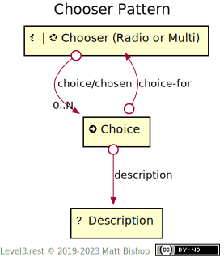
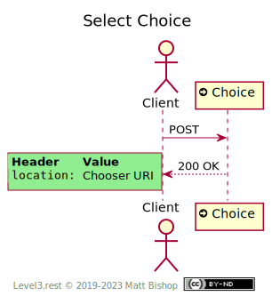

# Chooser Pattern

Chooser is a hypermedia control that presents one or more choices for clients to select. A [Chooser](#chooser-resource) has two types that determine how many selections are possible. The types are patterned after HTML's selection `<input>` formats. The  `radio` type accepts a single selection. The `checks` type can accept multiple choices.

A client examines the [Description](#description-resource) resource of each [Choice](#choice-resource) and makes their selection by triggering the Choice action resource. The result of the `POST` changes the state of the Choice. If the Choice's `checked` property was `false`, it becomes `true` after the action. If the Choice's `checked` property was `true` then it changes to `false` after the action.

{: .center-image}

The Choice's state is changed on the action, as is the state of the Chooser overall. For a `radio` chooser, selecting a choice deselects a previously-selected choice. For a  `checks` chooser, the overall chooser's state may change, depending on the business rules the chooser is representing. For this reason, the `Location` response header from choice actions points to the Chooser resource so that the client can fetch the overall chooser state again.

{: .center-image}

## Chooser Resource

`Profile: <http://level3.rest/patterns/chooser#chooser-resource>`

The Choice resource presents either the [Info](../profiles/info.md) or [Nexus](../profiles/nexus.md) profile. It has the following state:

| Property | Purpose                                                      |
| -------- | ------------------------------------------------------------ |
| `type`   | `radio` for single selections, `checks` for 0 or more selections. |

If the Chooser resource presents the [Nexus](../profiles/nexus.md) profile, then it can be deleted with a `DELETE` operation. The Choice resources are deleted as well. The Description resources may not be part of the domain, and if they are not, then they are not deleted.

### choice

```
rel="http://level3.rest/patterns/chooser#choice"
```

A Chooser resource has 0 or more `choice` links pointing to [Choice](#choice-resource) resources in its list. The ordering of the links is intentional, meaning they should be considered the presentation order of the choices. The HTTP specifications require [header order](https://tools.ietf.org/html/rfc7230#section-3.2.2) to be maintained so clients can expect consistent link order.

## Choice Resource

`Profile: <http://level3.rest/patterns/chooser#choice-resource>`

The Choice resource presents the [Action](../profiles/action.md) profile. It has the following state:

| Property  | Purpose                                                      |
| --------- | ------------------------------------------------------------ |
| `checked` | Indicates the selected state of the choice with `true` or `false`. |

### choice-for

```
rel="http://level3.rest/patterns/chooser#choice-for"
```

This link points to the [Chooser](#chooser-resource) to which this Choice belongs.

### description

```
rel="http://level3.rest/patterns/chooser#description"
```

This link points to a [Description](#description-resource) that describes this Choice. This relation is similar to the registered IANA relation "describedby."

## Description Resource

Describes the [Choice](#choice-resource). Its profile is undefined as it could point to any resource in any domain. As an example, if the Chooser selects addresses, this Description resource links to an entry in an address list. Because of this, the Description resource has no choice-specific links or profile. It is unaware that it participates in a Chooser pattern.

## Specifications

HTML 5.2: [Input Element](https://www.w3.org/TR/html52/sec-forms.html#the-input-element)

- Checkbox: [section 4.10.5.1.15](https://www.w3.org/TR/html52/sec-forms.html#checkbox-state-typecheckbox)
- Radio Button: [section 4.10.5.1.16](https://www.w3.org/TR/html52/sec-forms.html#radio-button-state-typeradio)

HTTP/1.1 Message Syntax and Routing: [RFC 7230](https://tools.ietf.org/html/rfc7230)

- Header Field Order: [section 3.2.2](https://tools.ietf.org/html/rfc7230#section-3.2.2)

Protocol for Web Description Resources: [POWDER](https://www.w3.org/TR/powder-dr/)

- “describedby”: [Appendix D](https://www.w3.org/TR/powder-dr/#appD)

