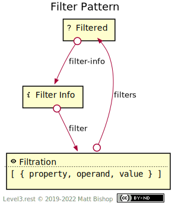

# Filter Pattern

The Filter pattern provides filtration affordances. It often complements List and Tree patterns but can also be used to filter any resource that has elements with filterable aspects. The Filter pattern has a [Filter Info](#filter-info-resource) resource that describes the filter configuration. Clients can change the filter configuration with the [Filtration](#filtration-resource) resource. The elements in the resource should share the filterable properties for the [Filtered](#filtered-resource) resource to make sense to the client.

{: .center-image}

### Operands

Filter declarations use logical operands to describe how to filter the elements by property values. String value comparisons should be case-insensitive if possible, though the resource implementation decides this rule based on the field's semantics. The resource's data types guide the applicability of these operands to filtered fields.

These operands work efficiently with indexed data and should provide quick client responses.

| Operand | Purpose                          |
| ------- | -------------------------------- |
| `eq`    | Equal                            |
| `ne`    | Not equal                        |
| `lt`    | Less than                        |
| `lte`   | Less than or equal               |
| `gt`    | Greater than                     |
| `gte`   | Greater than or equal            |
| `px`    | String prefix                    |
| `npx`   | Not this string prefix           |
| `sx`    | String suffix                    |
| `nsx`   | Not this string suffix           |
| `in`    | In a list of possible values     |
| `nin`   | Not in a list of possible values |

## Filtered Resource

```
Profile: <https://level3.rest/patterns/filter#filtered-resource>
```

The Filtered resource can present any profile. The profile choice does not effect filtering options.

### filter-info

```
rel="https://level3.rest/patterns/filter#filter-info"
```

Points to a [Filter Info](#filter-info-resource) resource that describes the filtered resources filtering configuration.

## Filter Info Resource

```
Profile: <https://level3.rest/patterns/filter#filter-info-resource>
```

The Filter Info resource describes the current filtering configuration used in the [Filtered](#filtered-resource) resource. The configuration representation consists of an array of filter declarations assigned to a top-level `filters` element.

A filtering declaration in the `filters` array has these properties:

| Property   | Purpose                             |
| ---------- | ----------------------------------- |
| `property` | The property being filtered.        |
| `operand`  | The filtering [operand](#operands). |
| `value`    | The filter value.                   |

Each filter declaration further filters the elements by that declaration. The array of declarations `AND`s together to create an element list that matches every filter. Consider this filters array:

```json
{ 
  "filters": [
    { "property": "age", "operand": "gte", "value": 30 }, 
    { "property": "team", "operand": "in", "value": ["Bruins", "Canucks"] }
  ]
}
```

The filtered resource contains elements filtered by `age` (>= 30) and a `team` of either “Bruins” or “Canucks.”

The XML representation looks like this:

```xml
<filters>
  <filter property="age" operand="gte" value="30"/>
  <filter property="team" operand="in">
    <value>Bruins</value>
    <value>Canucks</value>
  </filter>
</filters>
```

### filter

```
rel="https://level3.rest/patterns/filter#filter"
```

Points to a [Filtration](#filtration-resource) resource that configures the filtration of the [Filtered](#filtered-resource) resource.

## Filtration Resource

```
Profile: <https://level3.rest/patterns/filter#filtration-resource>
```

The Filtration resource changes the [Filtered](#filtered-resource) resource's filtration configuration. It is a [Form](../profiles/form.md) resource that starts with the current configuration in its schema representation, or its template object if the form does not use a schema. If only a subset of the properties are filterable, then the Filtration resource should present a schema to help the client submit a successful filtration change.

The form creates a filters array. This array has objects with these properties:

| Property   | Purpose                             |
| ---------- | ----------------------------------- |
| `property` | The property being filtered.        |
| `operand`  | The filtering [operand](#operands). |
| `value`    | Filter value.                       |

### filters

```
rel="https://level3.rest/patterns/filter#filters"
```

Points to the [Filtered](#filtered-resource) resource that this Filtration resource filters.


