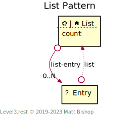

# List Pattern

Lists are a common, central component in most APIs. A Level 3 List is an [ordered list of entries](https://en.wikipedia.org/wiki/List_(abstract_data_type)), rather than an unordered collection. The [HTTP spec](https://tools.ietf.org/html/rfc7230#section-3.2.2) is clear that multiple header values are considered sequences and their presentation order must be maintained. Lists take advantage of this requirement to present entries as an ordered list.

{: .center-image}

The List pattern delivers many list capabilities across several extension patterns.

1. [Pageable List](list/pageable.md) pattern offers a way to paginate the list. 
2. [Editable List](list/editable.md) provides capabilities to add entries to the list and empty the list.
3. [Sortable List](list/sortable.md) gives a client the ability to sort the list entries by orderable Entry properties.

All of these extensions are simultaneously utilizable. The extensions have configuration controls which change the list's entry list view. When the extensions are combined, changes to one extension's configuration does not reset the other extensions' configurations. For instance, if a client is sorting the list by a "first-name" property, and then changes the page number in the [Pagination](list/pagination.md#pagination-resource) control, the "first-name" sort ordering is still applied to the list.

The extension patterns cover common list manipulation use cases. They are not exhaustive; API designers should complement them with extensions to express more-specific capabilities if their use cases require.

##### List Entry Domain Considerations

List entries may belong to the list's domain, or they may exist in a different domain. An example of list and entries in the same domain is the task list API. Task list entries belong to the same domain as the task list itself and can support editing capabilities. When a client deletes the list, all the tasks are deleted as well. When a client deletes a task, it is removed from the system altogether.

An example of external domain entries is a search results list. The entries in the list are links to resources in another domain, like a product catalogue or content database. The list is [filterable](filter.md), [sortable](list/sortable.md), [pageable](list/pageable.md) and partially [editable](list/editable), but the edits to the list do not affect the external entry. That resource does not know that it participates in a list and does not bear the entry resource profile and `list` link.

A List resource may want to create entries that link to resources in an external domain. The list has full editability without affecting the other domain's resources. The List can [add entries](list/editable#add-entry) to the list, remove entries with a `DELETE` operation.

For example, consider a product wishlist API. A wishlist entry would reference a product resource via a linked relation, yet the Entry resource itself is part of the wishlist domain. This wishlist Entry can be deleted, modified, or otherwise manipulated as part of the wishlist without affecting the product itself.

## List Resource

`Profile: <http://level3.rest/patterns/list#list-resource>`

The List resource presents either the [Info](../profiles/info.md) or [Nexus](../profiles/nexus.md) profile.

| Property | Purpose                            |
| -------- | ---------------------------------- |
| `count`  | The number of Entries in the list. |

If the List resource presents the [Nexus](../profiles/nexus.md) profile, then it can be deleted with a `DELETE` operation. The entries in the list are deleted as well if they are part of the same domain. See [List Entry Domain Considerations](#list-entry-domain-considerations) for details.

### list-entry

```
rel="http://level3.rest/patterns/list#list-entry"
```

A List resource has 0 or more `list-entry` links pointing to Entry resources in its list. The client should consider the link order to be the current order of the list.

## Entry Resource

`Profile: <http://level3.rest/patterns/list#entry-resource>`

An Entry resource has no required profile. If the Entry's profile supports the `DELETE` operation, a client can remove the entry from the list by deleting the entry.

### *list*

```
rel="http://level3.rest/patterns/list#list"
```

The `list` link points to the [List](#list-resource) to which the entry is a member. An entry is usually only part of one list, but it is not a requirement.

This link does not appear if the entry is not part of the List’s domain. See [List Entry Domain Considerations](#list-entry-domain-considerations) for details.

## Specifications

HTTP/1.1 Message Syntax and Routing: [RFC 7230](https://tools.ietf.org/html/rfc7230)

- Header Field Order: [section 3.2.2](https://tools.ietf.org/html/rfc7230#section-3.2.2)

