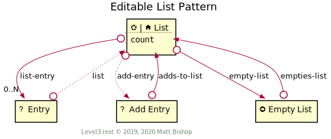

# Editable List Pattern

Editabe List expands the [List](../list.md) pattern by adding editing controls. An editable list pattern may not enable all editing controls. An editable list can choose to omit a control, like [Add Entry](#add-entry-resource), in favour of another approach that is more intuitive to the semantics of the list. 

This diagram includes the existing List resources [List](../list.md#list-resource) and [Entry](../list.md#entry-resource) and adds additional relationships to new resources to make it an editable list. The List resource's profiles includes both the [editable/list-resource](#list-resource) profile and the base [list-resource](../list.md#list-resource) profile.

The Entry resource in the diagram is unchanged from the base list's [Entry](../list.md#entry-resource) and has no extension profile.

{: .center-image}

## List Resource

```
Profile: <http://level3.rest/patterns/list/editable#list-resource>
```

The Editable List resource inherits the base [List](../list.md#list-resource) resource's profile requirements.

### empty-list

```
rel="http://level3.rest/patterns/list/editable#empty-list"
```

Leads to an [Empty List](#empty-list-resource) action that empties the [List](#list-resource) when triggered.

### *add-entry*

```
rel="http://level3.rest/patterns/list/editable#add-entry"
```

Points to an [Add Entry](#add-entry-resource) resource that adds an entry to the list. This relationship is optional and may be implemented with a more semantic relationship like “add-to-basket” on a product in a shopping API or “add-to-team” on a player profile in a fantasy sports league API.

## Empty List Resource

```
Profile: <http://level3.rest/patterns/list/editable#empty-list-resource>
```

[Action](../../profiles/action.md) resource that empties the [List](#list-resource). Triggering the action returns a `Location` pointing to the list.

### empties-list

```
rel="http://level3.rest/patterns/list/editable#empties-list"
```

Links to the [List](#list-resource) that is emptied by this action.

## Add Entry Resource

```
Profile: <http://level3.rest/patterns/list/editable#add-entry-resource>
```

Add Entry resource adds an [Entry](../list.md#entry-resource) to the list. The profile is undefined, but it is often a [Form](../../profiles/form.md) resource.

### adds-to-list

```
rel="http://level3.rest/patterns/list/editable#adds-to-list"
```

Links to the [List](#list-resource) into which the Add Entry resource adds entries.


