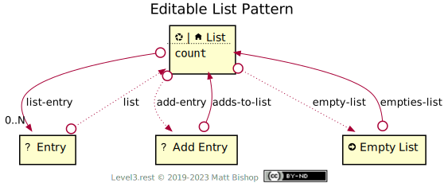

# Editable List Pattern

Extends [List](../list.md) pattern by adding editing controls. Not all editing controls are enabled in every editable list. An editable list can choose to omit a control, like [Add Entry](#add-entry-resource), in favor of another approach that is more intuitive to the semantics of the list. This diagram includes the existing List resources [List](../list.md#list-resource) and [Entry](../list.md#entry-resource), then adds additional relationships to new resources to make it an editable list. The List resource's Profiles includes both the [editable/list-resource](#list-resource) profile and the base [list-resource](../list.md#list-resource) Profile.

The Entry resource in the diagram is unchanged from the base list's [Entry](../list.md#entry-resource), and has no extension Profile.

{: .center-image}

## List Resource

`Profile: <http://level3.rest/patterns/list/editable#list-resource>`

The Editable List resource inherits the base [List](../list.md#list-resource) resource's Profile requirements. If the List is a [Nexus](../../profiles/nexus.md) resource, it will accept a `DELETE` operation to remove the list.

### *empty-list*

```
rel="http://level3.rest/patterns/list/editable#empty-list"
```

Leads to an [Empty List](#empty-list-resource) action  that will empty the list when triggered.

### *add-entry*

```
rel="http://level3.rest/patterns/list/editable#add-entry"
```

List can use the Add Entry resource that can add an Entry to the List.

## Empty List Resource

`Profile: <http://level3.rest/patterns/list/editable#empty-list-resource>`

[Action](../../profiles/action.md) resource that empties the List.

### empties-list

```
rel="http://level3.rest/patterns/list/editable#empties-list"
```

Link to the List that will be emptied by this action.

## Add Entry Resource

`Profile: <http://level3.rest/patterns/list/editable#add-entry-resource>`

A resource that will add an entry to the list. The Profile is undefined, but it is often a [Form](../../profiles/form.md) resource.

### adds-to-list

```
rel="http://level3.rest/patterns/list/editable#adds-to-list"
```

Link that points to the List that will be added to.

