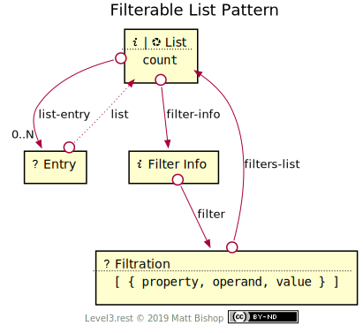

# Filterable List Pattern

Extends [List](../list.md) pattern by adding filtration affordances. A filtered [List](#list-resource) has a [Filter Info](#filter-info-resource) resource that describes the filter configuration. Clients can change the filter configuration with the [Filtration](#filtration-resource) resource. The Entries in the list should share the filterable properties for the filltered List to make sense to the Client.

{: .center-image}

### Operands

Filter declarations use logical operands to describe how to filter the entries in a list by property values.

| Operand | Purpose                          |
| ------- | -------------------------------- |
| `eq`    | Equal                            |
| `ne`    | Not equal                        |
| `lt`    | Less than                        |
| `lte`   | Less then or equal               |
| `gt`    | Greater than                     |
| `gte`   | Greater than or equal            |
| `in`    | In a list of possible values     |
| `nin`   | Not in a list of possible values |

## List Resource

`Profile: <http://level3.rest/patterns/list/filterable#list-resource>`

The filterable List resource inherites the base [List](../list.md#list-resource) resource's Profile requirements. The Profile choice has no effect on filtering options.

### filter-info

```
rel="http://level3.rest/patterns/list/filterable#filter-info"
```

Points to a [Filter Info](#filter-info-resource) resource that describes the configuration of the current list's entry filtering.

## Filter Info Resource

`Profile: <http://level3.rest/patterns/list/filterable#filter-info-resource>`

The Filter Info resource describes the filtering configuration used in the current List. The configuration consists of an array of filter declarations. This array is assigned to a top-level `filters` element in the representation.

A filtering declaration in the `filters` array has these properties:

| Property   | Purpose                                                   |
| ---------- | --------------------------------------------------------- |
| `property` | The Entity property being filtered by                     |
| `operand`  | The filtering operand                                     |
| `value`    | Operation value TODO is there a better term than "value"? |

Each additional filter declaration futher filters the elements by that declaration. The array of declarations `AND`s together to create an element list that matches every filter. Consider this filters array:

```json
{ 
  "filters": [
    { "property": "age", "operand": "gte", "value": 30 }, 
    { "property": "team", "operand": "in": "value": ["Bruins", "Canucks"] }
  ]
}
```

The list will be filtered by `age` (>= 30) and a `team` of either "Bruins" or "Canucks".

The XML representation would look like this:

```xml
<filters>
  <filter property="age" operand="gte" value="30"/>
  <filter property="team" operand="in">
    <value>Bruins</value>
    <value>Canucks</value>
  </filter>
</filters>
```

### filter

```
rel="http://level3.rest/patterns/list/filterable#filter"
```

Points to a Filtration resource that can configure the entry filters of the list.

## Filtration Resource

`Profile: <http://level3.rest/patterns/list/filterable#filtration-resource>`

The Filtration resource affordances change the list's filtration configuration. It is a Form resource that starts with the current configuration in it's schema representation, or in it's template object if the form does not use a schema. If only a subset of the Entry properties are filterable then the Filtration resource should present a schema to help the Client submit a successful filtration change.

The Form will create a filters array. This array will have objects with these properties:

| Property   | Purpose                                                   |
| ---------- | --------------------------------------------------------- |
| `property` | The Entity property being filtered by                     |
| `operand`  | The filtering operand                                     |
| `value`    | Operation value TODO is there a better term than "value"? |

### filters-list

```
rel="http://level3.rest/patterns/list/filterable#filters-list"
```

Points to the List that this Filtration resource filters. The URL may not be the same after the Filtration resource's controls are executed.

