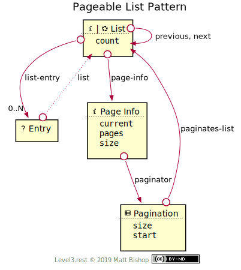
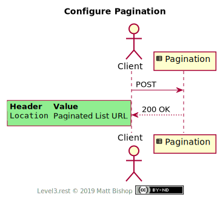

# Pageable List Pattern

Extends [List](../list.md) pattern by adding pagination affordances. A paginated [List](#list-resource) has a [Page Info](#page-info-resource) resource that describes the pagination configuration. The List also has cursor links to the `previous` and `next` pages of the list. Clients can change the pagination configuration with the [Pagination](#pagination-resource) resource.

The Entry resource in the diagram is unchanged from the base list's [Entry](../list.md#entry-resource), and has no extension Profile.

{: .center-image}

The Client changes page configuration by `POST`ing a new configuration form to the [Pagination](#pagination-resource) resource. This changes the URL of the [List](#list-resource) resource, so Pagination returns the updated List URL in it's `Location` response header.

{: .center-image}

## List Resource

`Profile: <http://level3.rest/patterns/list/pageable#list-resource>`

The Pageable List resource inherits the base [List](../list.md#list-resource) resource's Profile requirements. The Profile choice has no effect on pagination.

### page-info

```
rel="http://level3.rest/patterns/list/pageable#page-info"
```

Points to a [Page Info](#page-info-resource) resource that describes the configuration of the current pagination.

### next

```
rel="http://level3.rest/patterns/list/pageable#next"
```

Points to another [List](#list-resource) resource that contains the next page of entries. This "next" List resource is often the same as the current List resource but with a different URL. Similar in concept to IANA's "next" link relation, which is defined by HTML 5 as the next document in a sequence.

### previous

```
rel="http://level3.rest/patterns/list/pageable#previous"
```

Points to another [List](#list-resource) resource that contains the previous page of entries. This "previous" List resource is often the same as the current List resource but with a different URL. Similar in concept to IANA's "previous" link relation, which is defined by HTML 5 as the previous document in a sequence.

## Page Info Resource

`Profile: <http://level3.rest/patterns/list/pageable#page-info-resource>`

The Page Info resource describes the pagination configuration used in the current List. This resource should have relevant state fields describing the current page, page size and other information that will help the Client determine which page the related Paginated List resource is representing.

| Property  | Purpose                                                      |
| --------- | ------------------------------------------------------------ |
| `current` | The current page. Page numbers are 1-based.                  |
| `pages`   | The number of pages in the paginated list. May be unknown, so a Client will need to accept text statements in this property. |
| `size`    | The number of Entries per page.                              |

### paginator

```
rel="http://level3.rest/patterns/list/pageable#paginator"
```

Points to a Pagination resource that can configure the pagination for the list.

## Pagination Resource

`Profile: <http://level3.rest/patterns/list/pageable#pagination-resource>`

The Pagination resource is an affordance to change the pagination configuration of the list. It is a Form resource containing the current configuration. The Client can change the page size or the starting page so the Client can select a different page to view. Once the form is submitted, the Client will be redirected to a List resource configured with this pagination configuration.

| Property | Purpose                                                      |
| -------- | ------------------------------------------------------------ |
| `size`   | The number of Entries per page.                              |
| `start`  | The starting page for the List view. Clients use this property to control what page to view. |

### paginates-list

```
rel="http://level3.rest/patterns/list/pageable#paginates-list"
```

Points to the List that this Pagination resource configures. The URL may not be the same after the Pagination resource's controls are executed.

## Specifications

HTML 5 Link Types: [section 4.8.6](https://www.w3.org/TR/html5/links.html#sec-link-types)

- The “next” Link Relation Type: [section 4.8.6.13.1](https://www.w3.org/TR/html5/links.html#link-type-next)
- The “prev” Link Relation Type: [section 4.8.6.13.2](https://www.w3.org/TR/html5/links.html#link-type-prev)

