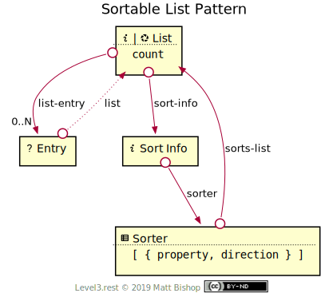

# Sortable List Pattern

Extends [List](../list.md) pattern by adding sorting affordances. A sorted [List](#list-resource) has a [Sort Info](#sort-info-resource) resource that describes the order configuration. Clients can change the sort order configuration with the [Sorter](#sorter-resource) resource. The Entries in the list should share the sortable properties for the sorted List to make sense to the client.

The Entry resource in the diagram is unchanged from the base list's [Entry](../list.md#entry-resource), and has no extension profile.

{: .center-image}

The client changes sort configuration by `POST`ing a new configuration form to the [Sorter](#sorter-resource) resource. This changes the URL of the [List](#list-resource) resource, so Sorter returns the updated List URL in it's `Location` response header.

{: .center-image}

## List Resource

`Profile: <http://level3.rest/patterns/list/sortable#list-resource>`

The Sortable List resource inherits the base [List](../list.md#list-resource) resource's profile requirements. The profile choice has no effect on sorting options.

### sort-info

```
rel="http://level3.rest/patterns/list/sortable#sort-info"
```

Points to a [Sort Info](#sort-info-resource) resource that describes the configuration of the current list's entry order.

## Sort Info Resource

`Profile: <http://level3.rest/patterns/list/sortable#sort-info>`

The Sort Info resource describes the ordering configuration used in the current List. The configuration consists of an array of sorting declarations. This array is assigned to a top-level `sort-order` element in the representation.

A sorting declaration in the `sort-order` array has these properties:

| Property    | Purpose                            |
| ----------- | ---------------------------------- |
| `property`  | The Entry property being sorted by |
| `direction` | Either `ascending` or `descending` |

Each additional sorting declaration sub-sorts the elements by that declaration. Consider this sort order array:

```json
{ 
  "sort-order": [
    { "property": "age", "direction": "descending" }, 
    { "property": "last-name", "direction": "ascending" }
  ]
}
```

The list will be sorted first by `age` (oldest first), and inside each age group the list will be sorted by `last-name` in ascending order (alphabetical).

The XML representation would look like this:

```xml
<sort-order>
  <sort-by property="age" direction="descending"/> 
  <sort-by property="last-name" direction="ascending"/> 
</sort-order>
```

### sorter

```
rel="http://level3.rest/patterns/list/sortable#sorter-resource"
```

Points to a Sorter resource that can configure the entry order of the list.

## Sorter Resource

`Profile: <http://level3.rest/patterns/list/sortable#sorter-resource>`

The Sorter resource is an affordance to change the order configuration of the list. It is a Form resource that starts with the current configuration in it's schema representation, or in it's template object if the Form resource does not use a schema. If only a subset of the Entry properties are sortable then the Sorter resource should present a schema to help the client submit a successful sorting change.

The Form will create a sorting declaration array. This array will have objects with these properties:

| Property    | Purpose                            |
| ----------- | ---------------------------------- |
| `property`  | The Entry property being sorted by |
| `direction` | Either `ascending` or `descending` |

### sorts-list

```
rel="http://level3.rest/patterns/list/sortable#sorts-list"
```

Points to the List that this Sorter resource configures. The URL may not be the same after the Sorter resource's controls are executed.

