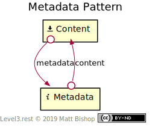

# Metadata Pattern

[Content profile](../profiles/content.md) resources are difficult to inspect because they contain metadata that is only discoverable after the client downloads the content. The Metadata pattern solves this by linking a [Content](#content-resource) resource to a [Metadata](#metadata-resource) resource describing the content. A client can examine the metadata and then decide to download all the content.

If the Content resource changes, the metadata may change as well to reflect new metadata values. If the client deletes a Content resource, it also deletes the related [Metadata](#metadata-resource) resource.

Metadata’s [Info](../profiles/info.md) profile means the client cannot edit or delete the metadata directly. An API may wish to add user-editable resources like descriptions, tags or other information and link it to the [Content](#content-resource) resource. These additional resource relationships are outside the scope of this pattern.

{: .center-image}

## Content Resource

```
Profile: <https://level3.rest/patterns/metadata#content-resource>
```

The Content resource presents the [Content profile](../profiles/content.md). It is the image, document or other content data described by the [Metadata](#metadata-resource) resource.

### metadata

```
rel="https://level3.rest/patterns/metadata#metadata"
```

The `metadata` link relation is similar to IANA’s “[describedby](https://www.w3.org/TR/powder-dr/#appD)” link relation. It points to the Metadata resource that describes the [Content](#content-resource) resource.

## Metadata Resource

```
Profile: <https://level3.rest/patterns/metadata#metadata-resource>
```

The Metadata resource presents the [Info profile](../profiles/info.md) and contains relevant details about the [Content](#content-resource) resource, depending on the type of content. Images can have metadata about the dimensions, resolution and colour model. Documents may contain metadata about the page count and author.

Metadata should be used in other API contexts like search results or directory listings as they provide useful information for the client to select a Content resource. The `content` link gives the client navigability to the actual Content data should they choose to consume it.

### content

```
rel="https://level3.rest/patterns/metadata#content"
```

The `content` link relation is similar to IANA’s “[describes](https://tools.ietf.org/html/rfc6892)” link relation. It points to the [Content](#content-resource) resource that Metadata describes.

## Specifications

Protocol for Web Description Resources: [POWDER](https://www.w3.org/TR/powder-dr/)

- “describedby”: [Appendix D](https://www.w3.org/TR/powder-dr/#appD)

The “describes” Link Relation Type: [RFC 6892](https://tools.ietf.org/html/rfc6892)


