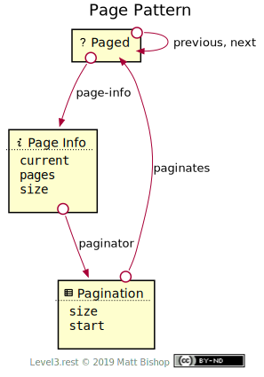
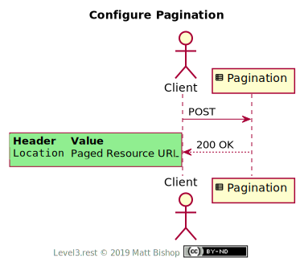

# Page Pattern

The Page pattern adds pagination affordances to resources that have multiple elements. The [List](#list.md) pattern often applies the Page pattern, giving clients control over pagination of the list’s entries.

The [Paged](#paged-resource) resource has a [Page Info](#page-info-resource) resource that describes the pagination configuration. The paged resource also has cursor links to the `previous` and `next` pages. Clients can change the pagination configuration with the [Pagination](#pagination-resource) resource. An API may add additional pagination links to specific page markers if they choose.

{: .center-image}

The client changes page configuration by `POST`ing a new configuration form to the [Pagination](#pagination-resource) resource. Pagination returns the updated [Paged](#paged-resource) resource URL in it's `Location` response header.

{: .center-image}

## Paged Resource

`Profile: <http://level3.rest/patterns/page#paged-resource>`

The Paged resource can present any profile. The profile choice does not affect pagination.

### page-info

```
rel="http://level3.rest/patterns/page#page-info"
```

Points to a [Page Info](#page-info-resource) resource that describes the configuration of the [Paged](#paged-resource) resource's pagination.

### next

```
rel="http://level3.rest/patterns/page#next"
```

Points to another [Paged](#paged-resource) resource that contains the next page of elements. This relationship is similar in concept to IANA's "next" link relation, which is defined by HTML 5 as the next document in a sequence.

### previous

```
rel="http://level3.rest/patterns/page#previous"
```

Points to another [Paged](#paged-resource) resource that contains the previous page of elements. This relationship is similar in concept to IANA's "previous" link relation, which is defined by HTML 5 as the previous document in a sequence.

## Page Info Resource

`Profile: <http://level3.rest/patterns/page#page-info-resource>`

The Page Info resource describes the pagination configuration used in the [Paged](#paged-resource) resource. This resource should have relevant state fields describing the current page, page size and other information that helps the client determine which page the related Paged resource represents.

| Property  | Purpose                                                      |
| --------- | ------------------------------------------------------------ |
| `current` | The current page. Page numbers are 1-based.                  |
| `pages`   | The number of pages in the Paged resource. May be unknown, so a client will need to accept text statements in this property. |
| `size`    | The number of elements per page.                             |

### paginator

```
rel="http://level3.rest/patterns/page#paginator"
```

Points to a [Pagination](#pagination-resource) resource that can configure the pagination.

## Pagination Resource

`Profile: <http://level3.rest/patterns/page#pagination-resource>`

The Pagination resource is an affordance to change the pagination configuration. It is a [Form](../profiles/form.md) resource containing the current configuration. The client can change the page size or the starting page so the client can select a different page to view. Once the client submits the form, the response's `Location` points to a [Paged](#paged-resource) resource configured with this pagination configuration.

| Property | Purpose                                                      |
| -------- | ------------------------------------------------------------ |
| `size`   | The number of elements per page.                             |
| `start`  | The starting page for the Paged view. Clients use this property to control what page to view. |

### paginates

```
rel="http://level3.rest/patterns/page#paginates"
```

Points to the [Paged](#paged-resource) resource that this Pagination resource configures.

## Specifications

HTML 5 Link Types: [section 4.8.6](https://www.w3.org/TR/html5/links.html#sec-link-types)

- The "next" Link Relation Type: [section 4.8.6.13.1](https://www.w3.org/TR/html5/links.html#link-type-next)
- The "prev" Link Relation Type: [section 4.8.6.13.2](https://www.w3.org/TR/html5/links.html#link-type-prev)

