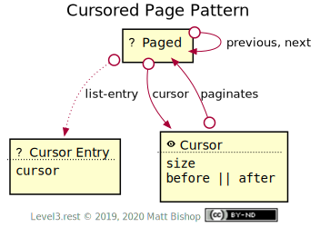
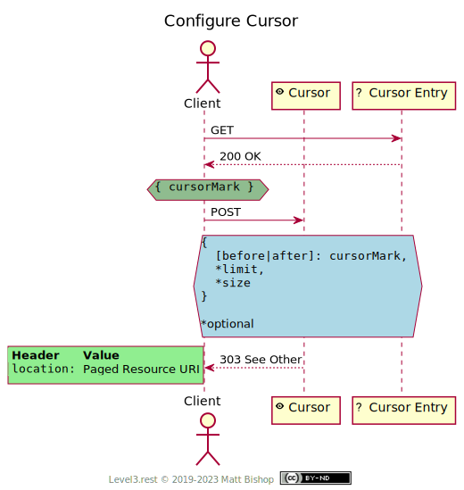

# Cursored Page Pattern

The Cursored Page pattern adds cursor-management affordances to the [Page](../page.md) pattern, giving clients control over the pagination of the list’s elements.

The [Paged](#paged-resource) resource retains the cursor-style links to the `previous` and `next` pages. Clients can change the cursor configuration with the [Cursor](#cursor-resource) resource.

{: .center-image}

### Changing Cursor Configuration

The client changes cursor configuration by `POST`ing a new configuration form to the [Cursor](#cursor-resource) resource. Cursor returns the newly-configured [Paged](#paged-resource) resource URL in its `Location` response header.

If the Paged resource follows the List pattern, then the [Cursor Entry](#cursor-entry-resource) resource will contain a cursor field to change the cursor configuration with. However, if the Paged resource presents a data-oriented list of elements, those data elements may contain a `cursor` field that can be used to change the cursor pagination start or end point with the [Cursor](#cursor-resource) resource.

{: .center-image}

If instead of utilizing the List pattern, the Paged resource is a list of data, then the individual elements must have a `cursor` property that can be used in the Cursor form to change the paged cursor position.

See the [Cursor](#cursor-resource) resource reference for more details on how to change the page size and cursor position.

## Paged Resource

```
Profile: <https://level3.rest/patterns/page#paged-resource>
```

See the documentation for [Paged resource](../page.md).

### cursor

```
rel="https://level3.rest/patterns/page/cursor#cursor"
```

Points to a [Cursor](#cursor-resource) resource that can configure the cursor pagination.

## list-entry

```
rel="https://level3.rest/patterns/list#list-entry"
```

Points to individual [Cursor Entry](#cursor-entry-resource) resources in the List. This relationship is required for paged List resources using the Cursored Page pattern. See the List [Entry](../list.md#entry-resource) description for more details about this resource profile.

## Cursor Entry Resource

```
Profile: <https://level3.rest/patterns/page/cursor#cursor-entry-resource>,
         <https://level3.rest/patterns/list#entry-resource>
```

In a List resource, the cursor entries are individual [List Entry](../list.md#entry-resource) resources that contain a field with the entry’s cursor value. This value is used to change the pagination point via the [Cursor](#cursor-resource) resource. Lists that use the Cursored Page resource must provide Cursor Entry resources with the `cursor` property.

| Property | Purpose                                                      |
| -------- | ------------------------------------------------------------ |
| `cursor` | The Entry’s cursor value. Useful for changing the start or end point of the pagination configuration. |

## Cursor Resource

```
Profile: <https://level3.rest/patterns/page/cursor#cursor-resource>
```

The Cursor resource is a form to change the cursor pagination configuration. It is a [Form](../../profiles/form.md) resource containing the current configuration. The client can specify the page size and either the `before` or `after` cursor to select a different page point to navigate through. Once the client submits the form, the response’s `Location` points to a [Paged](#paged-resource) resource configured with this configuration. 

| Property | Purpose                                                      |
| -------- | ------------------------------------------------------------ |
| `size`   | The number of elements per page. If not present in the form, the current page size configuration will be used. |
| `before` | The cursor value to view preceding elements from. The element at this cursor will not be presented. The Paged resource’s `next` and `previous` links will navigate in the same order so that the client will follow the `previous` link to navigate backwards through the list. |
| `after`  | The cursor value to view proceeding element from. The element at this cursor will not be presented. |

If the client only wants to change the page size, but keep the same cursor position, then they only need to post the `size` field in the form. If they wish to change the position of the cursor, they supply either the `before` or `after` field in the form. This `cursor` value comes from either the [Cursor Entry](#cursor-entry-resource) resource or the `cursor` property of an element in a resource’s list data.

### paginates

```
rel="https://level3.rest/patterns/page/cursor#paginates"
```

Points to the [Paged](#paged-resource) resource that this Cursor resource configures.


