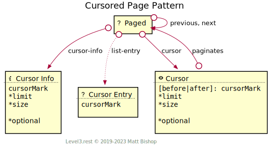

# Cursored Page Pattern

The Cursored Page pattern adds cursor management affordances to the [Page](../page.md) pattern, giving clients cusrsor-style control over the retrieval of the resource’s data.

The [Paged](#paged-resource) resource contains links to the `previous` and `next` element in the cursor. Clients can change the cursor configuration with the [Cursor](#cursor-resource) resource. These links have different meaning depending on the type of Paged resource. 

#### Data List

In a Data list, the resource presents a list of data points, such as a JSON array. The size of the list in the data page is managed by the `size` attribute of the Cursor. Each step via `next` and `previous` deliver a page of data with `size` count of elements. A common example is stock price history.

#### Cursored List

The Paged resource is a [List](../list.md) resource with `list-entry` links to Cursor Entry resources. The number of `list-entry` links on the Paged resource is managed by the `size` attrubute of the Cursor. An example would be search results, where each List Entry represents a resource in the result list. The Cursor Entry’s `cursorMark` gives the client the ability to position the cursor at that entry for further navigation. If a mark cannot be provided on the Entry resource then the client will use the Cursor Info’s `cursorMark` to reposition the cursor.

#### Cursored Documents

In this model, the Paged Resource has no `size` concept; each Page is an element in the cursor, like a carousel.  The client will step through the cursor by following the `next` and `previous` links.


{: .center-image}

### Changing Cursor Configuration

The client changes cursor configuration by `POST`ing a new configuration to the [Cursor](#cursor-resource) resource. Cursor returns the newly-configured [Paged](#paged-resource) resource URL in its `Location` response header.

If the Paged resource follows the List pattern, then each list entry is a [Cursor Entry](#cursor-entry-resource) resource, containing a `cursorMark` field that identifies that element’s position in the list. This value can be passed to the Cursor resource as a `befor` or `after` value to change the cursor position.

Similarly, if the Paged resource presents a data-oriented list of items, like an array of data, those data items should contain a `cursorMark` field so the client can change the cursor’s  `before` or `after` point with the [Cursor](#cursor-resource) resource.

{: .center-image}

See the [Cursor](#cursor-resource) resource reference for more details on how to change the cursor position and limit.

## Paged Resource

```
Profile: <https://level3.rest/patterns/page#paged-resource>
```

See the documentation for [Paged resource](../page.md).

### *cursor-info*

```
rel="https://level3.rest/patterns/page/cursor#cursor-info"
```

Points to a [Cursor Info](#cursor-info-resource) resource that describes the [Paged](#paged-resource) resource’s cursor configuration and state.

## Cursor Info Resource

```
Profile: <https://level3.rest/patterns/page/cursor#cursor-info-resource>
```

The Cursor Info resource describes the cursor configuration used in the [Paged](#paged-resource) resource. This resource has the current `cursorMark` and the limit set for the current cursor.

| Property     | Purpose                                                                                                    |
|--------------|------------------------------------------------------------------------------------------------------------|
| `cursorMark` | The current page’s `cursorMark`. Useful as a before/after value to fetch a new batch of cursored elements. |
| `limit`      | The item count specified when the cursor was created.                                                      |
| `size`       | How many elements present on each page. This property applies to data lists and list resources.            |

### *cursor*

```
rel="https://level3.rest/patterns/page/cursor#cursor"
```

Points to a [Cursor](#cursor-resource) resource that can configure the cursor pagination.

### *list-entry*

```
rel="https://level3.rest/patterns/list#list-entry"
```

Points to individual [Cursor Entry](#cursor-entry-resource) resources in the List. This relationship is required for paged List resources using the Cursored Page pattern. See the List [Entry](../list.md#entry-resource) description for more details about this resource profile.

## Cursor Entry Resource

```
Profile: <https://level3.rest/patterns/page/cursor#cursor-entry-resource>,
         <https://level3.rest/patterns/list#entry-resource>
```

In a List resource, the cursor entries are individual [List Entry](../list.md#entry-resource) resources that contain a field with the entry’s cursor value. This value is used to change the cursor’s position via the [Cursor](#cursor-resource) resource. Data lists that use the Cursored Page resource must provide Cursor Entry resources with the `cursor` property.

| Property     | Purpose                                                      |
| ------------ | ------------------------------------------------------------ |
| `cursorMark` | The Entry’s cursor value. Useful for changing the pagination configuration with the [Cursor](#cursor-resource) resource. |

## Cursor Resource

```
Profile: <https://level3.rest/patterns/page/cursor#cursor-resource>
```

The Cursor resource changes the cursor pagination configuration. It is a [Lookup](../../profiles/lookup.md) resource containing the current configuration. The client can specify a `limit` on the number of elements fetched for the cursor and either the `before` or `after` cursorMark to select a different cursor point to navigate through. They can also set the `size` of each page to manage the number of elements to present per page. Once the client submits the lookup, the client redirects to the [Paged](#paged-resource) resource configured with this configuration.

| Property | Purpose                                                                                                                                                                                                                                                                               |
|----------|---------------------------------------------------------------------------------------------------------------------------------------------------------------------------------------------------------------------------------------------------------------------------------------|
| `before` | The `cursorMark` to view preceding elements from. The element at this `cursorMark` will not be presented. The Paged resource’s `next` and `previous` links will navigate in the same order so that the client will follow the `previous` link to navigate backwards through the list. |
| `after`  | The `cursorMark` to view proceeding element from. The element at this `cursorMark` will not be presented.                                                                                                                                                                             |
| `limit`  | The number of elements to consume for the cursor. If not present in the lookup, the current cursor limit configuration will be used.                                                                                                                                                  |
| `size`   | The number of elements to be present on each page.                                                                                                                                                                                                                                    |

If the client only wants to change the page limit, but keep the same cursor position, then they only need to send the `limit` field in the lookup. If they wish to change the position of the cursor, they supply either the `before` or `after` field in the lookup. This `cursorMark` value comes from either the [Cursor Entry](#cursor-entry-resource) resource or the `cursorMark` property of an element in a resource’s list data.

### *paginates*

```
rel="https://level3.rest/patterns/page/cursor#paginates"
```

Points to the [Paged](#paged-resource) resource that this Cursor resource configures.


