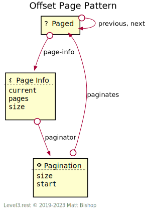

# Offset Page Pattern

The Offset Page pattern adds pagination affordances to resources that have multiple elements. The [List](../list.md) pattern often applies the Offset Page pattern, giving clients control over pagination of the list’s elements.

The [Paged](#paged-resource) resource (such as a [List](../list.md) resource) has a link to a [Page Info](#page-info-resource) resource that describes the pagination configuration. The Paged resource also has links to the `previous` and `next` pages as defined in the base [Page](../page.md) pattern. Clients can change the pagination configuration with the [Pagination](#pagination-resource) resource.

{: .center-image}

### Changing Offset Paging Configuration

The client changes page configuration by `POST`ing a new configuration to the [Pagination](#pagination-resource) resource. This configuration contains the page size and starting page. Pagination responds to the `POST` by returning a newly-configured [Paged](#paged-resource) resource URL in the `Location` response header. The client redirects to this URL to start paging through the elements. See the [Pagination](#pagination-resource) resource for more information.

{: .center-image}

## Paged Resource

```
Profile: <https://level3.rest/patterns/page#paged-resource>
```

See the documentation for [Paged resource](../page.md).

### *page-info*

```
rel="https://level3.rest/patterns/page/offset#page-info"
```

Points to a [Page Info](#page-info-resource) resource that describes the [Paged](#paged-resource) resource’s pagination configuration.

## Page Info Resource

```
Profile: <https://level3.rest/patterns/page/offset#page-info-resource>
```

The Page Info resource describes the pagination configuration used in the [Paged](#paged-resource) resource. This resource has relevant state fields describing the current page, page size and total pages count to help the client determine which page the Paged resource represents.

| Property  | Purpose                                                                                                                      |
|-----------|------------------------------------------------------------------------------------------------------------------------------|
| `current` | The current page. Page numbers are 1-based.                                                                                  |
| `pages`   | The number of pages in the Paged resource. May be unknown, so a client will need to accept text statements in this property. |
| `size`    | The number of elements per page.                                                                                             |

### *paginator*

```
rel="https://level3.rest/patterns/page/offset#paginator"
```

Points to a [Pagination](#pagination-resource) resource that can configure the pagination.

## Pagination Resource

```
Profile: <https://level3.rest/patterns/page/offset#pagination-resource>
```

The Pagination resource is a [Lookup](../../profiles/lookup.md) resource that changes the pagination offset configuration. The client can change the page size or the start page so the client can select a different page to view. Once the client submits the lookup, the client redirects to a [Paged](#paged-resource) resource configured with this configuration.

| Property | Purpose                                                                                                                                                                                                                                                        |
|----------|----------------------------------------------------------------------------------------------------------------------------------------------------------------------------------------------------------------------------------------------------------------|
| `size`   | The number of elements per page.                                                                                                                                                                                                                               |
| `start`  | The starting page for the Paged view. Clients use this property to control what page to view. This value is 1-based, and if it is greater than the maximum pages available in the result set then the last page will be set as the start page in the response. |

### *paginates*

```
rel="https://level3.rest/patterns/page/offset#paginates"
```

Points to the [Paged](#paged-resource) resource that this Pagination resource configures.


