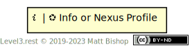

# Patterns

A Level 3 Pattern combines two or more resources into a more-useful whole. These patterns solve common interaction problems API designers face and give the client consistent experiences across different API domains. The pattern descriptions have a common presentation format, which include `Profile` and `Link` headers.

Patterns can offer extensions that expand the capabilities of the pattern. For example, the [List pattern](list.md) has a [Pageable List](list/pageable.md) pattern extension that provides pagination controls for the List. The extension patterns mix into the main pattern by adding additional `Profile` and `Link` headers.

Pattern resources occasionally include properties that the client can expect to find and utilize. These properties are minimal, not exhaustive, meaning an implementation of a pattern might include more properties, but they must include the properties defined in the pattern.

### Patterns as Profiles

A resource that is participating in a pattern will include their part in that pattern in their `Profile` headers list. For instance, if a Nexus resource is part of a List pattern implementation, the header will be:

`Profile: <http://level3.rest/profiles/nexus>, <http://level3.rest/patterns/list#list-resource>` 

This will give the client the necessary information they need to interact with the resource in it's pattern's context. As a key, these profile types have an icon to help identify their roles in the diagrams. Note that mixin profiles are not included in patterns, but are naturally important parts of the resource's individual client experience. Patterns do not require mixin profiles to work.

{: .center-image}

In some cases, multiple profiles are acceptable for a given resource, and in that case the diagrams will include both, separated by a pipe character:

{: .center-image}

In other cases, the pattern has no specification for the profile of the resource, so it indicates this with the question mark:

{: .center-image}

### Link Relations

Each pattern has a diagram showing the link relations between the resources. These link relations are named with simple strings for clarity. In practice they should be fully-realized URLs, as per the [Web Linking](https://tools.ietf.org/html/rfc8288) standard for [extension relations](https://tools.ietf.org/html/rfc8288#section-2.1.2). Every pattern definition will include a description of each relationship name detailing it's full name and meaning. Not every relation is required in a pattern; those that are optional use dotted arrows and italicized relation names.

{: .center-image}

IANA's link relation registry may be useful in some API designs, but Level 3's pattern catalog has chosen to always use extension relations instead of the registry. The primary reason is to inform the client of the pattern's context for the relation. A client can follow the relationship URL to this documentation to learn what the relationship means in the pattern to which it participates in.

## Pattern Pages are Link Targets

The pattern descriptions are link targets in `Link` and `Profile` headers so that clients can inspect a running API, follow the links to this site and learn the specifics of the profile or link relation they are interested in. These URIs utilize fragments to point to the relevant part of the pattern.

