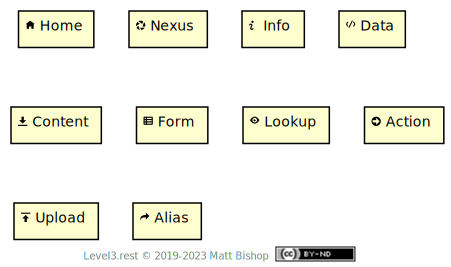
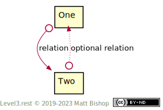

# Patterns

A Level 3 pattern combines two or more resources into a more-useful whole. These patterns solve common interaction problems API designers face and give the client consistent experiences across different API domains. The pattern descriptions have a joint presentation format, which includes `Profile` and `Link` headers.

Patterns can offer extensions that expand the capabilities of the pattern. For example, the [List pattern](list.md) has a [Editable List](list/editable.md) pattern extension that provides edit controls for the List. The extension patterns mix into the main pattern by adding additional `Profile` and `Link` headers.

Similarly, a resource may participate in more than one pattern. A [Tree](tree.md) pattern implementation may also utilize the [Filter](filter.md) pattern so clients can filter nodes from their result. Similarly, a [Sort](sort.md) pattern can be added to this combination to add tree node sorting. This approach is different than [Profile mixins](../profiles/mixins.md) in that the Sort and Filter pattern can stand alone. They can present their abilities to a resource with a list-like data structure.

Pattern resources occasionally include properties that the client can expect to find and utilize. These properties are minimal, not exhaustive, meaning implementations of a pattern might include more properties, but they must include the properties defined in the pattern.

### Patterns as Profiles

A resource that is participating in a pattern includes their part in that pattern in their `Profile` headers list. For instance, if a Nexus resource is part of a List pattern implementation, the header is:

```
Profile: <https://level3.rest/profiles/nexus>,
         <https://level3.rest/patterns/list#list-resource>
```

These headers give the client the necessary information they need to interact with the resource in its pattern’s context. As a key, these profile types have an icon to help identify their roles in the diagrams. Note that mixin profiles are not included in patterns, but are naturally part of the resource’s individual client experience. Patterns do not require mixin profiles to function.

{: .center-image}

In some cases, multiple profiles are acceptable for a given resource, and in that case, the diagrams include both, separated by a pipe character:

{: .center-image}

In other cases, the pattern has no specification for the profile of the resource, so it indicates this with the question mark:

{: .center-image}

### Link Relations

Each pattern has a diagram showing the link relations between the resources. These link relations use simple string names for clarity. In practice, they should be fully-realized URLs, as per the [Web Linking](https://tools.ietf.org/html/rfc8288) standard for [extension relations](https://tools.ietf.org/html/rfc8288#section-2.1.2).

Every pattern definition includes a description of each relationship name detailing its full name and meaning. Patterns may not require every relation; those that are optional use dotted arrows and italicized relation names.

{: .center-image}

IANA’s [link relation registry](https://www.iana.org/assignments/link-relations/link-relations.xhtml) may be useful in some API designs, but Level 3’s pattern catalogue has chosen to always use extension relations instead of the registry. The primary reason is to inform the client of the pattern’s context for the relation. A client can follow the relationship URL to this documentation to learn what the relationship means in the pattern.

## Pattern Pages are Link Targets

The pattern descriptions are link targets in `Link` and `Profile` headers so that clients can inspect a running API, follow the links to this site and learn the specifics of the profile or link relations. These URIs utilize fragments to point to a relevant part of the pattern on the page.

## Patterns can be Combined

Level 3 resource patterns can overlap and are simultaneously utilizable. When the patterns are combined, changes in one pattern configuration does not reset the other pattern’s configurations. For instance, the [List](list.md) pattern can combine the [Filter](filter.md), [Offset Page](page/offset.md) and [Sort](sort.md) patterns to create a full-featured list API. If a client is sorting the list by a `first-name` property, and then changes the page number in the [Pagination](page/offset.md#pagination-resource) control, the “first-name” sort ordering still applies to the list.

## Pattern Listing

- [List](list.md)
  - [Editable List](list/editable.md)
- [Tree](tree.md)
- [Filter](filter.md)
- [Sort](sort.md)
- [Page](page.md)
  - [Offset Page](page/offset.md)
  - [Cursored Page](page/cursor.md)
- [Chooser](chooser.md)
- [Stepper](stepper.md)
- [Toggle](toggle.md)
- [Process](process.md)
- [Metadata](metadata.md)


