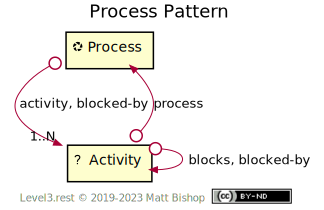
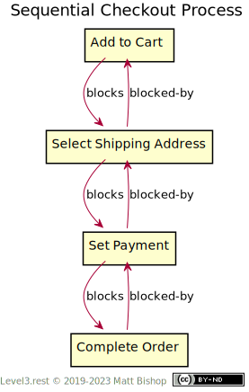

# Process Pattern

Wikipedia describes a [process](https://en.wikipedia.org/wiki/Process) as “…a set of activities that interact to produce a result.” The Process pattern models this set of activities as resources. An API can use the Process pattern to model many sequence-oriented workflows such as inventory processing, appointment scheduling, commerce checkout, job applications, and customer surveys.

{: .center-image}

The Process resource acts as the locus of one or more Activity resources representing steps or actions that are part of the overall process. Activities present controls like [Chooser](chooser.md) or [Forms](../profiles/form.md) that accept state change operations to complete the activity.

These activities can be dynamically added to a process, depending on other activity results. For instance, imagine a service sign-up process that allows both adults and minors, with their guardian’s permission, to join the service. One activity uses an age check form that asks for the person’s age. If the person indicates they are underage, a new activity called “guardian-permission” joins the process to collect the guardian’s consent for the sign-up.

### Activity Blocking Controls Process Flow

Activities can block other activities to control sequence and activity flow. A blocking activity resource attaches to another activity with a `blocks` link to indicate a sequential activity requirement to unblock the next activity in a flow. This blocking activity also attaches a `blocked-by` link to the process resource so the client can inspect all the activities blocking the process. Clients find messages in the blocking activity’s content that explain the blockage.

Activity blocking can model both sequential and parallel activities in a process. Consider a commerce checkout process. Suppose the API can support parallel checkout activities. The client can execute the “Select Shipping Address” activity or the “Set Payment” activity in either order. However, neither can start until “Add to Cart” has unblocked them. Similarly, “Complete Order” cannot start until the shipping and payment activities are complete.

{: .center-image}

The same checkout process can present a sequence of activities by chaining the `blocks` and `blocked-by` activities relationships in sequence:

{: .center-image}

Activities can reactivate previous `blocked-by` activities on the process. For instance, in our commerce example above, a shopper can select a “cash” payment option that only works with "pick up in store" shipping addresses. If the user selects a shipping address that is their home, rather than a retail location, the "cash" payment method blocks the "complete order" activity until the shopper resolves the conflict.

A Process finishes when all the blocking activities complete. The last activity may produce a `Location` to the a result resource, or the process itself is the completed resource.

## Process Resource

```
Profile: <https://level3.rest/patterns/process#process-resource>
```

The Process resource presents the [Nexus](../profiles/nexus.md) profile and may choose to support the `DELETE` operation. When the process instance is deleted, he activity resources in the process are also deleted.

Process shares the [`blocked-by`](#blocked-by) relationship with the Activity resource.

### *activity*

```
rel="https://level3.rest/patterns/process#activity"
```

Process resources have one or more `activity` links pointing to the list of activities. The order of the links is intentional and ordered in a blocking sequence or desired activity flow. The order of the activities is not strict, however, as many Activities are completable in other sequences or parallel. Clients can choose to present a set of Activities as a step-by-step wizard, or they may present them all at once in a single view.

The last Activity in the activity list completes the process when executed.

## Activity Resource

```
Profile: <https://level3.rest/patterns/process#activity-resource>
```

An Activity resource has no required profile. It is often another pattern that presents the activity’s state and a hypermedia control to change that state.

### *process*

```
rel="https://level3.rest/patterns/process#process"
```

The `process` link points to the [Process](#process-resource) of which the activity is a member.

### *blocks*

```
rel="https://level3.rest/patterns/process#blocks"
```

Activities can block other activities, which indicate the client should execute the blocking activity before attempting to execute the blocked one. The `blocks` link declares such a sequence. An activity can have multiple `blocks` relationships to other activities.

### *blocked-by*

```
rel="https://level3.rest/patterns/process#blocked-by"
```

The `blocked-by` link points to an activity that blocks this activity. The client should execute the `blocked-by` resource before executing this activity.

This relationship is similar to the IANA-registered `blocked-by` relationship. Unfortunately, that relationship describes legal obstacles rather than process flow obstacles.

## Specifications

HTTP/1.1 Message Syntax and Routing: [RFC 7230](https://tools.ietf.org/html/rfc7230)

- Header Field Order: [section 3.2.2](https://tools.ietf.org/html/rfc7230#section-3.2.2)

The `blocked-by` Link Relation Type: [RFC 7725](https://tools.ietf.org/html/rfc7725)


