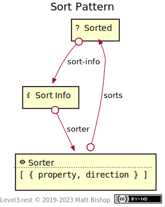
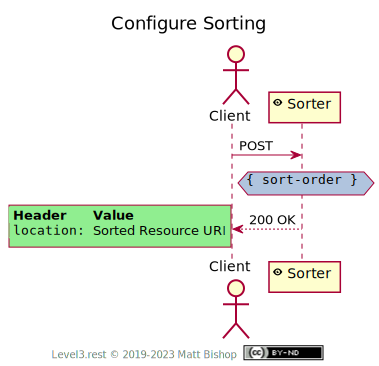

# Sort Pattern

The Sort pattern provides sorting affordances. It often complements List and Tree patterns but can also be used to sort any resource with sortable element aspects. The Sort pattern has a [Sort Info](#sort-info-resource) resource that describes the sorting configuration. Clients can change the sorting configuration with the [Sorter](#sorter-resource) resource. The elements in the resource should share the sortable properties for the [Sorted](#sorted-resource) resource to make sense to the client.

{: .center-image}

The client changes sort configuration by `POST`ing a new configuration form to the [Sorter](#sorter-resource) resource. Sorter returns the updated [Sorted](#sorted-resource) resource URL in it's `Location` response header.

{: .center-image}

## Sorted Resource

`Profile: <http://level3.rest/patterns/sort#sorted-resource>`

The Sorted resource can present any profile. The profile choice does not effect filtering options.

### sort-info

```
rel="http://level3.rest/patterns/sort#sort-info"
```

Points to a [Sort Info](#sort-info-resource) resource that describes the configuration of the [Sorted](#sorted-resource) resource's element order.

## Sort Info Resource

`Profile: <http://level3.rest/patterns/sort#sort-info>`

The Sort Info resource describes the ordering configuration used in the [Sorted](#sorted-resource) resource. This configuration consists of an array of sorting declarations, which Sort Info's representation assigns to a top-level `sort-order` element.

A sorting declaration in the `sort-order` array has these properties:

| Property    | Purpose                       |
| ----------- | ----------------------------- |
| `property`  | The property being sorted by. |
| `direction` | Either `ascend` or `descend`. |

Each additional sorting declaration sub-sorts the elements by that declaration. Consider this sort order array:

```json
{ 
  "sort-order": [
    { "property": "age", "direction": "descend" }, 
    { "property": "last-name", "direction": "ascend" }
  ]
}
```

The elements are sorted first by `age` (oldest first), and inside each age group, the elements are sorted by `last-name` in ascending order (alphabetical).

The XML representation looks like this:

```xml
<sort-order>
  <sort-by property="age" direction="descend"/> 
  <sort-by property="last-name" direction="ascend"/> 
</sort-order>
```

### sorter

```
rel="http://level3.rest/patterns/sort#sorter-resource"
```

Points to a [Sorter](#sorter-resource) resource that can configure the element order of the [Sorted](#sorted-resource) resource.

## Sorter Resource

`Profile: <http://level3.rest/patterns/sort#sorter-resource>`

The Sorter resource changes the [Sorted](#sorted-resource) resource's sorting configuration. It is a [Form](../profiles/form.md) resource that starts with the current configuration in its schema representation, or its template object if the Form resource does not use a schema. If only a subset of the properties is sortable, then the Sorter resource should present a schema to help the client submit a successful sorting change.

The Form creates a sorting declaration array. This array has objects with these properties:

| Property    | Purpose                       |
| ----------- | ----------------------------- |
| `property`  | The property being sorted by. |
| `direction` | Either `ascend` or `descend`. |

### sorts

```
rel="http://level3.rest/patterns/sort#sorts"
```

Points to the [Sorted](#sorted-resource) resource that this Sorter resource configures.

