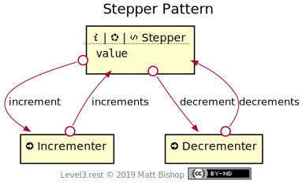

# Stepper Pattern

Stepper is a hypermedia control that presents a small-range value, such as item quantity or meeting duration, and offers affordances to increment and decrement that value. The Stepper pattern has a [Stepper](#stepper-resource) resource that contains the value to modify. Two [Action](../profiles/action.md) resources increment or decrement the value when they are triggered. These return a `Location` header pointing back to the modified Stepper resource.

{: .center-image}

The [increment](#increment) and [decrement](#decrement) links are present when the value can be modified, and absent when not. For instance, a cart line-item quantity stepper may not allow stepping below 1, or above the inventory count for that item. If the quantity is already 1, then the `decrement` link will be omitted. If the quantity is at its maximum value, then the `increment` link will be omitted.

## Stepper Resource

```
Profile: <https://level3.rest/patterns/stepper#stepper-resource>
```

A [Data](../profiles/data.md) resource that contains the value being incremented and decremented. This value can be a field in the data object, or it can be a single value. A Stepper resource can have multiple [Incrementers](#incrementer-resource) and [Decrementers](#decrementer-resource), one per field. The links may contain an [anchor](https://tools.ietf.org/html/rfc8288#section-3.2) property indicating the field to be stepped.

### increment

```
rel="https://level3.rest/patterns/stepper#increment";anchor="#field-path"
```

Points to an [Incrementer](#incrementer-resource) resource that increases the value of the [Stepper](#stepper-resource) resource by a single step. This relationship only appears if the value can be incremented, meaning the value has no range or it is below its maximum value. If present, the anchor property contains a field path to the property being incremented.

### decrement

```
rel="https://level3.rest/patterns/stepper#decrement";anchor="#field-path"
```

Points to a [Decrementer](#decrementer-resource) resource that decreases the value of the [Stepper](#stepper-resource) resource by a single step. This relationship only appears if the value can be incremented, meaning it is no range or it is above its minimum value. If present, the anchor property contains a field path to the property being decremented.

## Incrementer Resource

```
Profile: <https://level3.rest/patterns/stepper#incrementer-resource>
```

An [Action](../profiles/action.md) resource that increments the value (or field) of the [Stepper](#stepper-resource) resource by a single step. If the value is already at its maximum, `POST` to this resource is ignored.

### increments

```
rel="https://level3.rest/patterns/stepper#increments";anchor="#field-path"
```

Points to the [Stepper](#stepper-resource) resource that will be incremented. The anchor value in the link contains a path to the field being incremented, if relevant.

## Decrementer Resource

```
Profile: <https://level3.rest/patterns/stepper#decrementer-resource>
```

An [Action](../profiles/action.md) resource that decrements the value (or field) of the [Stepper](#stepper-resource) resource by a single step. If the value is already at its minimum, `POST` to this resource is ignored.

### decrements

```
rel="https://level3.rest/patterns/stepper#decrements";anchor="#field-path"
```

Points to the [Stepper](#stepper-resource) resource that will be decremented. The anchor value in the link contains a path to the field being incremented, if relevant.

## Specifications

Web Link Context (anchor): RFC 8288, [section 3.2](https://tools.ietf.org/html/rfc8288#section-3.2)


