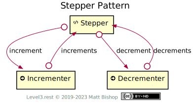

# Stepper Pattern

Stepper is a hypermedia control that presents a small-range value, such as like item quantity or meeting duration, and offers affordances to increment and decrement that value. The Stepper pattern has a [Stepper](#stepper-resource) resource that contains the value to modify. Two [Action](../profiles/action.md) resources increment or decrement the value when they are triggered. These return a `Location` header pointing back to the modified Stepper resource.

{: .center-image}

## Stepper Resource

`Profile: <http://level3.rest/patterns/stepper#stepper-resource>`

Contains the value being incremented and decremented. If the value can only be modified by increment or decrement actions, the Stepper resource should be an [Info](../profiles/info.md) profile. However, if the value can be modified with a `PUT` request, the Stepper must support the [Data](../profiles/data.md) profile.

### increment

```
rel="http://level3.rest/patterns/stepper#increment"
```

Points to an [Incrementer](#incrementer-resource) resource that increases the value of the [Stepper](#stepper-resource) resource by a single step. This relationship only appears if the value can be incremented, meaning the value has no range or it is below its maximum value.

### decrement

```
rel="http://level3.rest/patterns/stepper#decrement"
```

Points to a [Decrementer](#decrementer-resource) resource that decreases the value of the [Stepper](#stepper-resource) resource by a single step. This relationship only appears if the value can be incremented, meaning it is no range or it is above its minimum value.

## Incrementer Resource

`Profile: <http://level3.rest/patterns/stepper#incrementer-resource>`

An [Action](../profiles/action.md) resource that increments the value of the [Stepper](#stepper-resource) resource by a single step. If the value is already at its maximum, `POST` to this resource is ignored.

### increments

```
rel="http://level3.rest/patterns/stepper#increments"
```

Points to the [Steper](#stepper-resource) resource that will be incremented.

## Decrementer Resource

`Profile: <http://level3.rest/patterns/stepper#decrementer-resource>`

An [Action](../profiles/action.md) resource that decrements the value of the [Stepper](#stepper-resource) resource by a single step. If the value is already at its minimum, `POST` to this resource is ignored.

### decrements

```
rel="http://level3.rest/patterns/stepper#decrements"
```

Points to the [Stepper](#stepper-resource) resource that will be decremented.
