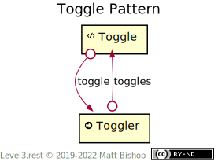

# Toggle Pattern

Toggle is a hypermedia control pattern that presents a bi-value, such as on/off or true/false, and offers an affordance to toggle that value from its current state to the opposite state. The Toggle pattern has a [Toggle](#toggle-resource) resource that contains the value to toggle. An [Action](../profiles/action.md) resource toggles the value when triggered. The Action returns a `Location` header pointing back to the modified Toggle resource.

{: .center-image}

## Toggle Resource

```
Profile: <https://level3.rest/patterns/toggle#toggle-resource>
```

A [Data](../profiles/data.md) resource that contains the value being toggled. This value can be a field in the data object, or it can be a single value. A Toggle resource can have multiple [Togglers](#toggler-resource), one per field. The links may contain an [anchor](https://tools.ietf.org/html/rfc8288#section-3.2) property indicating the field to be toggled.

### toggle

```
rel="https://level3.rest/patterns/toggle#toggle";anchor="#field-path"
```

Points to a [Toggler](#toggler-resource) resource that toggles the value of the [Toggle](#toggle-resource) resource to its opposite value. If present, the anchor property contains a field path to the property being toggled.

## Toggler Resource

```
Profile: <https://level3.rest/patterns/toggle#toggler-resource>
```

An [Action](../profiles/action.md) resource that toggles the value (or field) of the [Toggle](#toggle-resource) resource to its opposite value.

### toggles

```
rel="https://level3.rest/patterns/toggle#toggles";anchor="#field-path"
```

Points to the [Toggle](#toggle-resource) resource that will be toggled. The anchor value in the link contains a path to the field being toggled, if relevant.

## Specifications

Web Link Context (anchor): RFC 8288, [section 3.2](https://tools.ietf.org/html/rfc8288#section-3.2)


