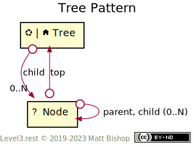

# Tree Pattern

[Trees](https://en.wikipedia.org/wiki/Tree_(data_structure)) represent real-world structures like directories, navigations, org charts and other hierarchies. Relationships bind the nodes of a tree together and give them context with the other nodes.

The Nodes in a tree have one `parent` link to their parent Node as well as a `top` link to the Tree. Top-level Nodes, those that are direct children of Tree, do not have a `parent` link. Nodes that have no `child` links are considered leaves.

{: .center-image}

## Tree Resource

```
Profile: <https://level3.rest/patterns/tree#tree-resource>
```

The Tree resource presents either the [Home](../profiles/home.md) or [Nexus](../profiles/nexus.md) profile and it can choose to support the `DELETE` operation. The node resources in the tree are also deleted. For instance, if the tree represents a file system, then deleting the Tree resource also deletes the child file and directory resources because the individual files have no context to exist outside of their directory.

The Tree resource shares the [`child`](#child) relationship with Node resource.

## Node Resource

```
Profile: <https://level3.rest/patterns/tree#node-resource>
```

A Node resource has no required profile. If the node’s profile supports the `DELETE` operation, a client can remove the node from the tree by deleting the node. This operation deletes all `child` nodes and their children as well.

### *top*

```
rel="https://level3.rest/patterns/tree#top"
```

The `top` link points to the [Tree](#tree-resource) of which the node is a member.

### *child*

```
rel="https://level3.rest/patterns/tree#child"
```

Tree and Node resources have 0 or more `child` links pointing to direct child [Node](#node-resource) resources. The ordering of the links is intentional, meaning they should be considered the sibling order. [HTTP header sequence rules](https://tools.ietf.org/html/rfc7230#section-3.2.2) ensure the client can rely on this order to be consistent with the resource’s ordering intentions.

### *parent*

```
rel="https://level3.rest/patterns/tree#parent"
```

The `parent` link points to the node’s parent [Node](#node-resource).

## Specifications

HTTP/1.1 Message Syntax and Routing: [RFC 7230](https://tools.ietf.org/html/rfc7230)

- Header Field Order: [section 3.2.2](https://tools.ietf.org/html/rfc7230#section-3.2.2)


