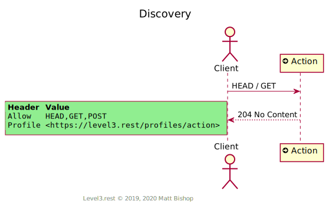
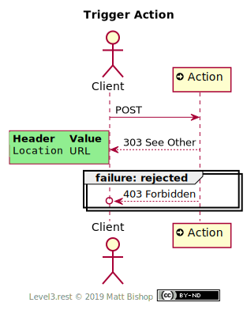

# Action

##### `Profile: <http://level3.rest/profiles/action>`

Action resources are a hypermedia control that trigger a state change. They act like buttons to execute an action. They do not accept a payload. All the action’s identifying information is found in it’s URL. 

### Discovery

The Action profile presents the required `Profile` and `Allow` headers.

{: .center-image}

### Trigger Action

Clients trigger an Action by `POST`ing to it. The resource will respond with `200 OK` and the `Location` header will point to the state that was changed by the triggered action.

{: .center-image}

# Mixins

## Representation Mixin

The [Representation profile](representation.md) mixin enables the Client to receive the target representation in the Action response.

## Specifications

HTTP/1.1 Semantics and Content: [RFC 7231](https://tools.ietf.org/html/rfc7231)

- 200 OK: [section 6.3.1](https://tools.ietf.org/html/rfc7231#section-6.3.1)
- 204 No Content: [section 6.3.5](https://tools.ietf.org/html/rfc7231#section-6.3.5)

