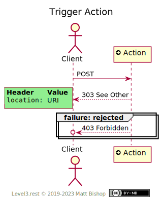

# Action Profile

##### `Profile: <http://level3.rest/profiles/action>`

An Action resource is a hypermedia control that triggers a state change. They act like buttons to execute an action on the server. Actions do not accept a payload; the URL contains all the Action’s identifying information.

### Discovery

The Action profile presents the required `Profile` and `Allow` headers.

{: .center-image}

### Trigger Action

Clients trigger an Action by `POST`ing to it. The resource responds with `204 No Content` and the `Location` header points to the state that was changed by the triggered action.

{: .center-image}

# Mixins

## Representation Mixin

The [Representation profile](representation.md) mixin enables the client to receive the target representation in the Action response.

## Specifications

HTTP/1.1 Semantics and Content: [RFC 7231](https://tools.ietf.org/html/rfc7231)

- 204 No Content: [section 6.3.5](https://tools.ietf.org/html/rfc7231#section-6.3.5)

