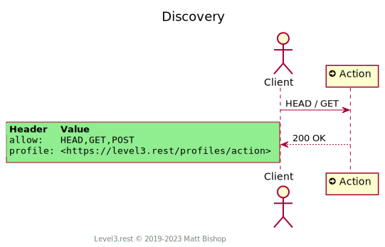

# Action Profile

```
Profile: <https://level3.rest/profiles/action>
```

An Action resource is a hypermedia control that triggers a state change. They act like buttons to execute an action on the server. Actions do not accept a payload; the URL contains all the Action’s identifying information.

### Discovery

The Action profile presents the required `Profile` and `Allow` headers.

{: .center-image}

### Trigger Action

Clients trigger an Action by `POST`ing to it. The resource responds with `303 See Other` and the `Location` header points to the state that was changed by the triggered action. The resource returns a `403 Forbidden` status if the action cannot be completed because the business state will not accept it.

{: .center-image}

# Mixins

## Representation Mixin

The [Representation profile](representation.md) mixin enables the client to receive the target representation in the Action response instead of a redirect to the `Location` URL.

## Specifications

HTTP/1.1 Semantics and Content: [RFC 7231](https://tools.ietf.org/html/rfc7231)

- 200 OK: [section 6.3.1](https://tools.ietf.org/html/rfc7231#section-6.3.1)
- 303 See Other: [section 6.4.4](https://tools.ietf.org/html/rfc7231#section-6.4.4)
- 403 Forbidden: [section 6.5.3](https://tools.ietf.org/html/rfc7231#section-6.5.3)



