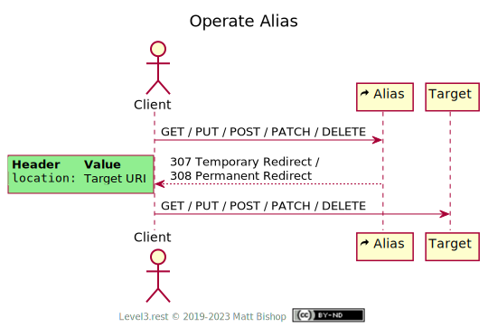

# Alias

##### `Profile: <http://level3.rest/profiles/alias>`

Alias resources act as a stable reference to another resource by redirecting operations to the other resource. That other resource may be unstable and thus not the same on every request. For instance, Alias can be used to point to the current cell tower a mobile phone has joined, or the airport gate a flight is currently parked.

The Alias can also redirect to resources that have moved, thus providing a way to support old versions of a resource in a way that helps the client learn about the new version. All operations are supported in by an Alias resource in the same way—a `3xx` status code returns with a `Location` header pointing to another URL.

Alias supports two kinds of redirection:

| Intent                       | Status Code              |
| ---------------------------- | ------------------------ |
| Stable URL, dynamic resource | `307 Temporary Redirect` |
| Permanent change             | `308 Permanent Redirect` |

An Alias resource supports all the operations of the target resource, including`HEAD`, `GET`, `PUT`, `POST`, `PATCH` and `DELETE`.

### Discovery

The Alias resource includes both its profile as well as the profile of the target resource in the `Profile` header. The `Location` header points to the aliased resource. It also shows the `Allow` header <u>for the target resource</u>. The status code matches the intent of the Alias—dynamic or permanent redirect.

{: .center-image}

### Operate Alias

A client can operate an Alias resource as if it were the target resource as long as their client supports automatic redirection. The client essentially operates against the target resource through the Alias resource.

If the client does not support automatic redirection, then they need to be aware of the Alias resource and make operations directly against the URL in the `Location` header. Clients need to examine the response code and act accordingly. For status code `307 Temporary Redirect`, the client should re-operate against the Alias URL for every request to work with the latest target URL. For status code `308 Permanent Redirect`, the client can memoize the `Location` URL and reuse it for subsequent operations.

Some complications may arise in the automatic redirect experience if the target URL points to a different domain. Some of the request headers might be stripped away on the second request. The API server needs to configure [CORS](https://www.w3.org/TR/cors/) to allow necessary headers to apply to the cross-origin request.

{: .center-image}

## Specifications

HTTP/1.1 Semantics and Content: [RFC 7231](https://tools.ietf.org/html/rfc7231)

- 307 Temporary Redirect: [section 6.4.7](https://tools.ietf.org/html/rfc7231#section-6.4.7)

The Hypertext Transfer Protocol Status Code 308: [RFC 7538](https://tools.ietf.org/html/rfc7538)

