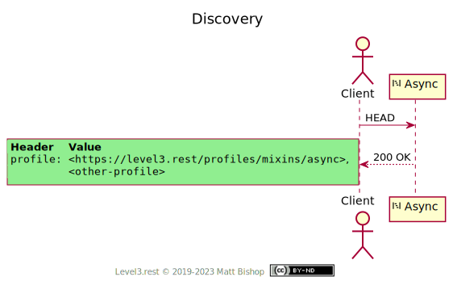
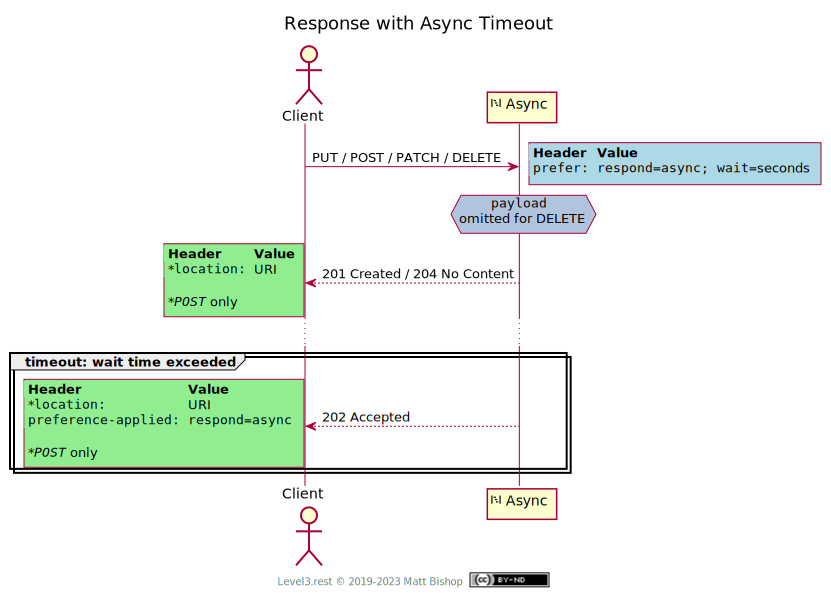
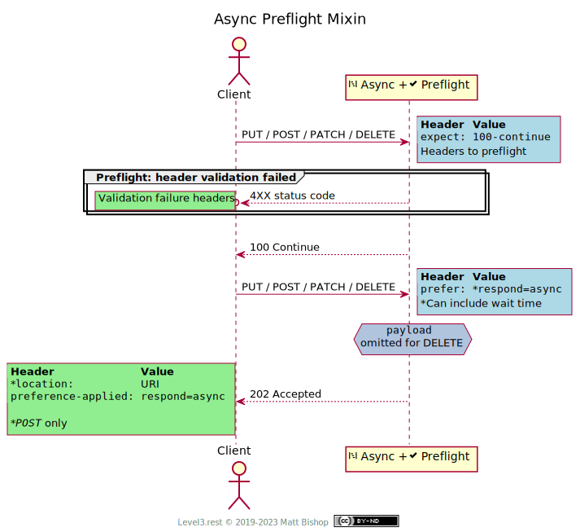

# Async (Mixin)

##### `Profile: <http://level3.rest/profiles/mixins/async>`

Resources that accept `POST`, `PUT`, `DELETE` or `PATCH` requests will block on the request until the operation is completed. A Client may not want to wait, so a resource can offer the Async profile to give the Client control over if they wait at all or time out after a specified number of seconds. Async profile lets the Client “fire and forget” the state change operation.

The Async resource will accept the state change request and the affected resource may eventually reflect the state modification in the request. Async `POST` operations will return a `Location` header, while async `PUT`, `DELETE` and `PATCH` operations will not. This profile offers no guarantees or timelines as to how long it will take for the operation to complete, nor offer any channel to communicate success or failure of the operation. A Client must determine eventual success by examining the state of the changed/deleted resource, ideally via [Entity](entity.md) validation headers, or examining the `Location` in `POST` operation.

The Async profile is intended for situations where an operation may take a long time to complete and the client merely does not want to wait. The Async resource should make an effort to validate the request, including header validation (for example, when [Entity](entity.md) or [Preflight](preflight.md) profiles are mixed in) and body syntax checking, if relevant. The Client must know if they have made a mistake with their request before the async operation is initiated.

Async profile is not used for batch- or job-style APIs where normal behavior is to submit a state change that will be processed some time in the future. That API should have semantics that manage the job and provide job status over time.

### Discovery

Resources that support the Async profile will include in the Async profile header it it's list of `Profile` headers.

{: .center-image}

### Immediate Async Response

In this flow, the Client does not want to wait for the operation to complete or [time out](#response-with-async-timeout); they simply get an acceptance of the operation from the resource. The Client sends a `Prefer: respond-async` header to tell the resource to return as soon as it can confirm the operation has been accepted. The resource returns a status of `202 Accepted`.

{: .center-image}

### Response with Async Timeout

The client sends a `Prefer: respond-async; wait=#seconds` header indicating that they want to wait for a set number of seconds for a complete response. If the `wait` time is exceeded and the operation is still ongoing, the resource will respond with `202 Accepted`. The wait time is suggestive, not an accurate service level.

{: .center-image}

## Mixins With Validations

When Async is mixed in with [Entity](entity.md) or [Preflight](preflight.md) profiles, the Client can expect header validation to occur before the async operation response is returned. This ensures the Client’s request is valid from the perspective of the mixins before the request is considered Accepted. If a mixin’s header validation fails, the request fails with their specific status response.

### Preflight Mixin

The Preflight mixin has a two-step flow. The Client preflights the request with `Expect` and omitting `Prefer`. On success the Client will send the async request in the second call. The first call (continue) cannot be asynchronously accepted.

{: .center-image}

## Specifications

HTTP/1.1 Semantics and Content: [RFC 7231](https://tools.ietf.org/html/rfc7231)

- 200 OK: [section 6.3.1](https://tools.ietf.org/html/rfc7231#section-6.3.1)
- 201 Created: [section 6.3.2](https://tools.ietf.org/html/rfc7231#section-6.3.2)
- 202 Accepted: [section 6.3.3](https://tools.ietf.org/html/rfc7231#section-6.3.3)
- 204 No Content: [section 6.3.5](https://tools.ietf.org/html/rfc7231#section-6.3.5)

Prefer Header for HTTP: [RFC 7240](https://tools.ietf.org/html/rfc7240)

- Preference-Applied: [section 3](https://tools.ietf.org/html/rfc7240#section-3)
- The respond-async preference: [section 4.1](https://tools.ietf.org/html/rfc7240#section-4.1)
- The wait preference: [section 4.3](https://tools.ietf.org/html/rfc7240#section-4.3)

