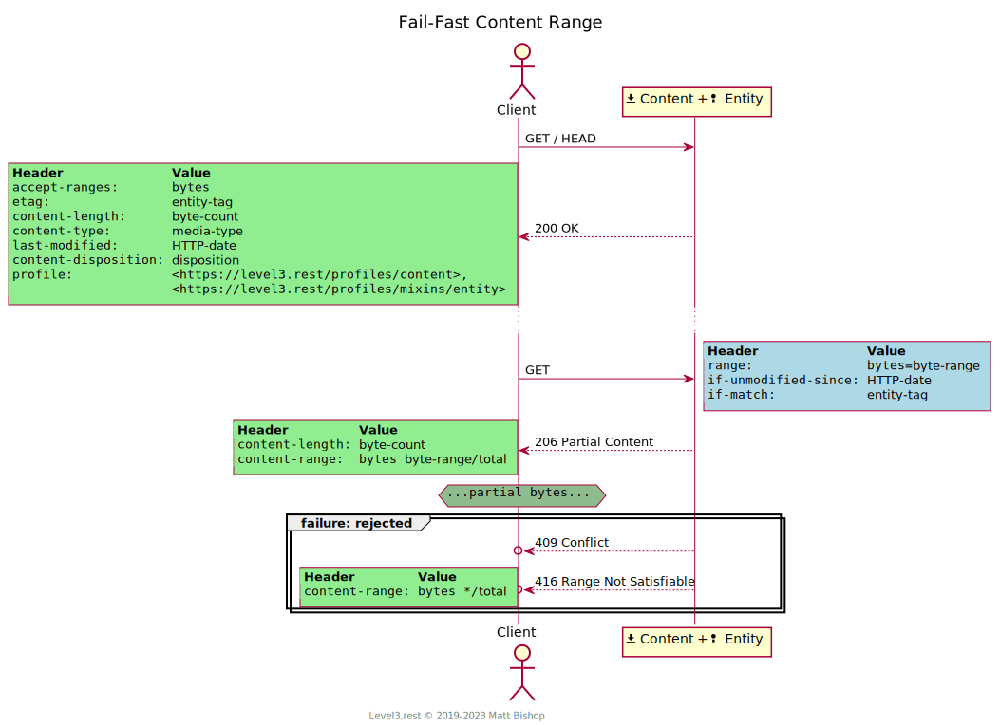

# Content Profile

```
Profile: <https://level3.rest/profiles/content>
```

Content resources represent byte-oriented data and can support range-based features like resumable downloads and skip-ahead downloading when they mix in the [Entity profile](entity.md).

### Discovery

A `HEAD` request will return the following response. The headers are explained in the table below.

{: .center-image}

| Header              | Value                                                        |
| ------------------- | ------------------------------------------------------------ |
| Accept-Ranges       | `bytes` means the resource accepts [range requests](#range-requests). `none` means this resource cannot accept range requests, or the resource accepts range requests, but the current Entity validators are not [strong](https://tools.ietf.org/html/rfc7232#section-2.1). |
| Content-Length      | The number of bytes in the content.                          |
| Content-Type        | The [*media-type*](https://tools.ietf.org/html/rfc7231#section-3.1.1.5) of the content. |
| Content-Disposition | `inline` or `attachment; filename="<filename>"`. See [RFC 6266](https://tools.ietf.org/html/rfc6266) for possible disposition statements. |
| Profile             | `<https://level3.rest/profiles/content>`                      |

### Fetch Content

Fetch the Content resource with a `GET` request. The body of the response contains the content bytes. The resource provides a `Content-Disposition` header indicating what a client should do with the content. See [RFC 6266](https://tools.ietf.org/html/rfc6266) for details.

{: .center-image}

### Change Content

A client can change the content’s bytes by sending a `PUT` request with the new content. The resource may reject the operation if the payload is too large or of the wrong media type.

{: .center-image}

Content resources do not support the `PATCH` or `POST` operations.

### Delete Content

A client can delete the Content resource by sending a `DELETE` request.

{: .center-image}

# Mixins

## Preflight Mixin

The [Preflight profile](preflight.md) mixin allows a client to validate content modification before sending a payload. The client must send `Content-Length` and `Content-Type` as preflight headers.

## Representation Mixin

Content resources can provide the [Representation profile](representation.md) as a mixin so the client can receive the modified representation in the response of a `PUT` operation.

## Entity Mixin

When a Content resource mixes in the Entity profile, it includes the Entity profile’s [validation headers](entity.md#discovery) in fetch requests. These headers enable Entity’s [Cache-Aware Fetch](entity.md#cache-aware-fetch) flow. These headers also enable [range requests](#range-requests). The `Accept-Ranges: bytes` header indicates that the resource can accept range requests.

The Entity mixin allows a Content resource to use Entity’s modification behaviours, including the option of preflighting operations based on validation headers:

- [Conditional Operation](entity.md#conditional-operation)
- [Forced Modification](entity.md#forced-modification)
- [Preflight Operation](entity.md#preflight-mixin)

### Range Requests

A client can download a portion of the content using a range request. They are useful for resuming interrupted downloads, jumping to a midway point in the content or downloading the content in stages.

The client has two options for range requests, and a Content resource must support both. One option ([Fail-Fast](#fail-fast)) fails the range request if the Entity validation headers do not match, and the other ([Refetch](#refetch)) switches to downloading the entire content if the validations do not match. A range request depends on validators to ensure the content’s bytes are the same from the previous request.

For both options the client [discovers](#discovery) the range and validator information with either a `HEAD` request or an incomplete `GET` request. The client then sends a `GET` request with the [byte range](https://tools.ietf.org/html/rfc7233#section-2.1) of the content they would like to receive in a `Range` header. If the content range cannot be delivered, a `416 Requested Range Not Satisfiable` is returned with the total number of available bytes in the `Content-Range` header. This condition occurs when the client requests a content range that goes beyond the size of the content itself.

##### Fail-Fast

Fail-Fast gives the client an option to perform range requests without triggering a full download if the client changes. The client follows the Entity [Cache-Aware Fetching](entity.md#cache-aware-fetch) flow with the additional `Range` header as described above. If the content is the same, then the client receives a `206 Partial Content` status and the partial payload defined in the range. If the content has changed, the client receives a `409 Conflict` status. In this case, the client may choose to [fetch the content](#fetch-content) without validation headers.

{: .center-image}

##### Refetch

Refetch allows the client to automatically restart a download if the content has changed from a previous attempt, but without processing a `409 Conflict` status code. The client sends the `ETag` value, or `Last-Modified` value if ETag is unavailable, in an `If-Match` header; it can contain either value, but not both. This single header validates the content has not changed. If the content has changed, or if the validators are not [strong](https://tools.ietf.org/html/rfc7232#section-2.1) then the full content is returned instead of the range. In this case, the resource responds as a [Fetch Content](#fetch-content) request.

{: .center-image}

##### No Multipart Ranges

The HTTP/1.1 Range Request specification allows requests to specify multiple ranges in the `Range` header, with the ranges delivered in a multipart-formatted response. However, the Content profile does not support these multiple range requests because they are complicated to support and increasingly-unnecessary given [HTTP/2’s ability to parallelize requests](https://hpbn.co/http2/#request-and-response-multiplexing). Clients that wish to fetch multiple parts should make multiple range requests and let HTTP/2 take care of the multiplexing.

## Specifications

HTTP/1.1 Message Syntax and Routing: [RFC 7230](https://tools.ietf.org/html/rfc7230)

- Content-Length: [section 3.3.2](https://tools.ietf.org/html/rfc7230#section-3.3.2)

HTTP/1.1 Semantics and Content: [RFC 7231](https://tools.ietf.org/html/rfc7231)

- Content-Type: [section 3.1.1.5](https://tools.ietf.org/html/rfc7231#section-3.1.1.5)
- 200 OK: [section 6.3.1](https://tools.ietf.org/html/rfc7231#section-6.3.1)
- 409 Conflict: [section 6.5.8](https://tools.ietf.org/html/rfc7231#section-6.5.8)
- 411 Length Required: [section 6.5.10](https://tools.ietf.org/html/rfc7231#section-6.5.10)
- 413 Payload Too Large: [section 6.5.11](https://tools.ietf.org/html/rfc7231#section-6.5.11)
- 415 Unsupported Media Type: [section 6.5.13](https://tools.ietf.org/html/rfc7231#section-6.5.13)

Content-Disposition: [RFC 6266](https://tools.ietf.org/html/rfc6266)

Conditional Requests: [RFC 7232](https://tools.ietf.org/html/rfc7232)

- Last-Modified: [section 2.2](https://tools.ietf.org/html/rfc7232#section-2.2)
- ETag: [section 2.3](https://tools.ietf.org/html/rfc7232#section-2.3)

Range Requests: [RFC 7233](https://tools.ietf.org/html/rfc7233)

- Range: [section 2.1](https://tools.ietf.org/html/rfc7233#section-2.1)
- Accept-Ranges: [section 2.3](https://tools.ietf.org/html/rfc7233#section-2.3)
- If-Range: [section 3.2](https://tools.ietf.org/html/rfc7233#section-3.2)
- 206 Partial Content: [section 4.1](https://tools.ietf.org/html/rfc7233#section-4.1)
- Content-Range: [section 4.2](https://tools.ietf.org/html/rfc7233#section-4.2)
- 416 Range Not Satisfiable: [section 4.4](https://tools.ietf.org/html/rfc7233#section-4.4)


