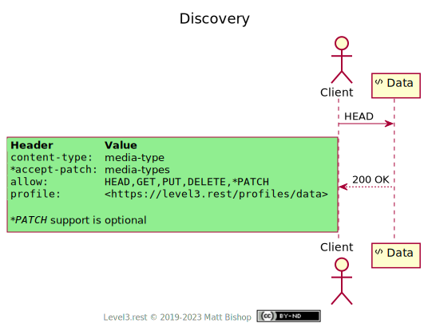
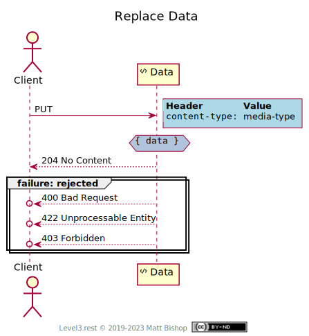
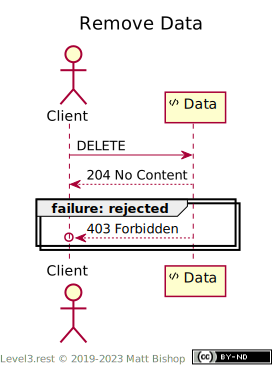

# Data Profile

```
profile: <https://level3.rest/profiles/data>
```

A Data resource represents a [first-class](https://en.wikipedia.org/wiki/First-class_citizen) data object in the world. Its properties are not computed from other resources, as are [Info](info.md) resources, but directly created by a system actor. A Data resource is intended to be editable by the client. It can offer the modification methods `PUT` and `PATCH`, and it can also offer `DELETE` if the resource is deletable. A Data resource often has business validation rules on the server to ensure data correctness.

### Discovery

The Data profile provides the required `profile` and `allow` headers. If the resource supports `PATCH` operations, it will include the `accept-patch` header with a list of acceptable patch media types. The client will need to understand these formats in order to construct a patch document to submit with a modification request. Some possible patch media types include [application/json-patch+json](https://tools.ietf.org/html/rfc6902), [application/merge-patch+json](https://tools.ietf.org/html/rfc7386), [application/xml-patch+xml](https://tools.ietf.org/html/rfc7351) or [application/patch-ops-error+xml](https://tools.ietf.org/html/rfc5261).

{: .center-image}

##### Schema Discovery

A data resource can help clients update the resource state by providing a data schema. HTTP has no response headers that would point to the data representation’s schema, but the data resource could respond to schema `content-type` requests such as [`application/ld+json`](https://json-ld.org), [`application/schema+json`](https://json-schema.org/latest/json-schema-core.html), or [`application/xml-dtd`](https://www.w3.org/2006/02/son-of-3023/draft-murata-kohn-lilley-xml-04.html) by returning schema documents. XML representations that use [XML Schema](https://www.w3.org/standards/xml/schema) should declare their `schemaLocation` properties as reachable URLs.

### Fetch Data

A client uses the `GET` operation to fetch the Data’s representation.

{: .center-image}

### Replace Data

A client can use the `PUT` operation to replace the data in a Data resource. However, a client cannot create (or recreate) a Data resource with the `PUT` operation. The URL must point to an existing data resource.

##### Rejections

| Status Code                | Explanation                                                       |
|----------------------------|-------------------------------------------------------------------|
| `400 Bad Request`          | The data’s body is malformed.                                     |
| `422 Unprocessable Entity` | The data is semantically-incorrect.                               |
| `403 Forbidden`            | Values in the data are not accepted by business validation rules. |

{: .center-image}

### Modify Data

If a Data resource offers the `PATCH` operation, then the client can modify the Data resource using a patch document. The client must use a patch format supported by the resource (as discovered in the `accept-patch` header) and construct a patch payload to submit with the `PATCH` operation. The client should send a `content-type` header indicating the patch format. If the resource supports more than one patch media type, it may require this header for disambiguation.

If the patch cannot be applied successfully, the resource returns `409 Conflict`. The client should re-fetch the data resource and rebuild the patch payload. If the patch is applicable, but the resulting data values violate business validation rules, the resource sends back `403 Forbidden`.

##### Patch Rejections

| Status Code                 | Explanation                                                                                                                                                                                                                     |
|-----------------------------|---------------------------------------------------------------------------------------------------------------------------------------------------------------------------------------------------------------------------------|
| `400 Bad Request`           | The patch’s syntax is malformed JSON or XML.                                                                                                                                                                                    |
| `422 Unprocessable Entity`  | The patch data is semantically-incorrect. Check the patch format specification for errors in the body.                                                                                                                          |
| `409 Conflict`              | The patch cannot be applied successfully because the state of the resource is not in the right shape to accept the patch. Consider using the [Entity](entity.md) mixin to help clients identify missed changes to the resource. |
| `403 Forbidden`             | Patch can be applied successfully, but the updated values in the data are not accepted by business validation rules.                                                                                                            |
| `428 Precondition Required` | `content-type` request header required.                                                                                                                                                                                         |

{: .center-image}

### Remove Data

A client can remove a Data resource by sending a `DELETE` request. If the resource cannot be deleted due to business reasons, the server will return `403 Forbidden` status.

{: .center-image}

# Mixins

## Entity Mixin

The [Entity](entity.md) mixin gives Data fetch cacheability and safe modification.

## Async Mixin

The [Async](async.md) mixin provides a client with “fire-and-forget” data modifications.

## Representation Mixin

The [Representation](representation.md) mixin allows the client to receive the modified data representation in the `PUT` or `PATCH` response.

## Specifications

HTTP Extensions for WebDAV: [RFC 4918](https://tools.ietf.org/html/rfc4918)

- 422 Unprocessable Entity: [section 11.2](https://tools.ietf.org/html/rfc4918#section-11.2)

XML Patch Operations Framework: [RFC 5261](https://tools.ietf.org/html/rfc5261)

PATCH Method for HTTP: [RFC 5789](https://tools.ietf.org/html/rfc5789)

- `accept-patch`: [section 4.1](https://tools.ietf.org/html/rfc5789#section-4.1)

Additional HTTP Status Codes: [RFC 6585](https://tools.ietf.org/html/rfc6585)

- 428 Precondition Required: [section 3](https://tools.ietf.org/html/rfc6585#section-3)

JSON Patch: [RFC 6902](https://tools.ietf.org/html/rfc6902)

HTTP/1.1 Semantics and Content: [RFC 7231](https://tools.ietf.org/html/rfc7231)

- 200 OK: [section 6.3.1](https://tools.ietf.org/html/rfc7231#section-6.3.1)
- 204 No Content: [section 6.3.5](https://tools.ietf.org/html/rfc7231#section-6.3.5)
- 403 Forbidden: [section 6.5.3](https://tools.ietf.org/html/rfc7231#section-6.5.3)
- 409 Conflict: [section 6.5.8](https://tools.ietf.org/html/rfc7231#section-6.5.8)

XML Patch: [RFC 7351](https://tools.ietf.org/html/rfc7351)

JSON Merge Patch: [RFC 7386](https://tools.ietf.org/html/rfc7386)



