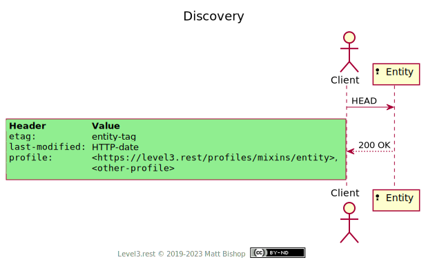
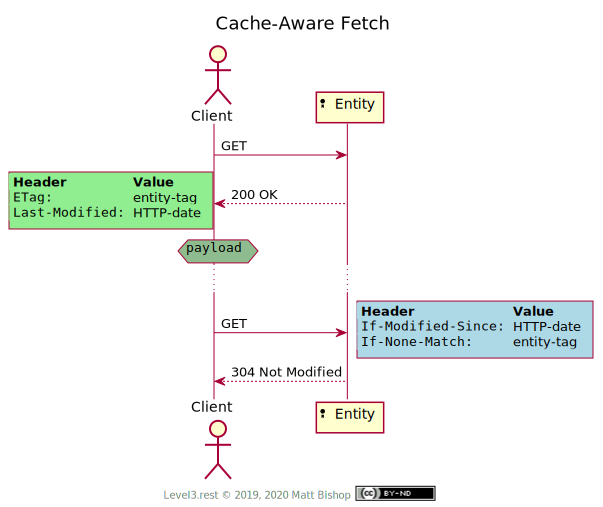
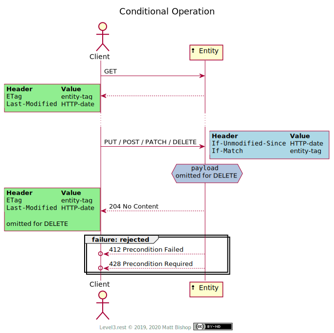
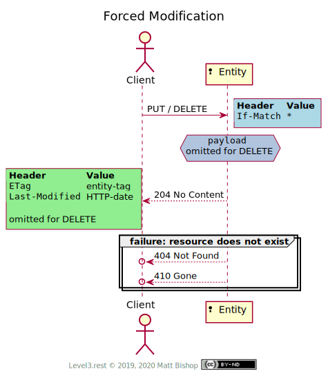

# Entity Profile (Mixin)

```
profile: <https://level3.rest/profiles/mixins/entity>
```

Resources often have identifiably-distinct instances of themselves defined by unique URIs. These instances are known as [Entities](https://wikipedia.org/wiki/entity) in the real world. An entity must exist to accept operations, and clients should perform operations on them with an awareness of their current state.

The HTTP specification has some essential features to support Entity operations. These features take the form of validation headers which manage both caching and safe state modifications. Thanks to these headers, clients enjoy the performance benefits of cached responses by using these same headers in `GET` requests. Also, clients can safely operate with an Entity resource by knowing the version they are working with has not changed since they last interacted with it.

The header values `etag` and `last-modified` are often transparently managed by HTTP clients, especially in browsers. A client should learn about conditional request support in their HTTP client library and enable these features.

Almost every Level 3 profile can use the Entity mixin to improve the client’s performance and safe usage. Resource implementers may find that it is more costly to support the Entity profile, but the gains for the client are usually worth the effort.

### Discovery

A `HEAD` request returns the headers described in the table below. An Entity resource may not be able to provide both `etag` and `last-modified`, but at least one must be provided for `HEAD` and `GET` requests.

{: .center-image}

| Header          | Value                                                                                                |
|-----------------|------------------------------------------------------------------------------------------------------|
| `etag`          | An [*entity-tag*](https://tools.ietf.org/html/rfc7232#section-2.3) identifying the entity version.   |
| `last-modified` | The [*HTTP-date*](https://tools.ietf.org/html/rfc7231#section-7.1.1.1) the entity was last modified. |

### Cache-Aware Fetch

When a client makes subsequent fetch requests for an already-fetched resource, they can send validator headers to indicate the version of the representation they possess. If the resource has not changed, then the resource responds with `304 Not Modified`, and the client can reuse already-fetched response.

{: .center-image}

### Conditional Operation

A client can modify an Entity resource’s state using `PUT` and `PATCH`, remove the resource using `DELETE`, or use the resource’s `POST` operation to create new resources. Due to the distributed nature of the internet, clients usually do not want to miss other modifications, either from another client or a backend system, and cause inconsistent state with their request.

This problem, known as the “lost update” problem, is solved by reusing the validator headers from the fetch request. The client sends the `etag` value in the `if-match` header and the `last-modified` value in the `if-unmodified-since` header with their operation.

{: .center-image}

If the client’s version of the resource does not match the resource’s version and modification date, the resource responds with `412 Precondition Failed`. The client must fetch the resource again and attempt the operation with new values for `if-match` and `if-unmodified-since`.

If the client does not send `if-match` or `if-unmodified-since` headers, and the resource requires them for the operations, it sends back `428 Precondition Required` to indicate this requirement. The client should `GET` the resource, evaluate its state and then send a conditional operation request with the new data. For `DELETE` operations the client may use `HEAD` instead to collect the most-current validation values.

Once the client’s operation is successful, the resource sends back the new `etag` and `last-modified` values in the response for `PUT` and `PATCH` operations. `POST` operations also return these headers, but they refer to the newly-created resource if it is an Entity resource. `DELETE` operations do not return validation headers.

Entity resources do not send back the representation on success, but rather `204 No Content`. It is reasonable to assume the client who just sent the modification request already has this payload locally and need not receive it again.

### Forced Modification

A client may decide that their change must override other client’s changes; they are not concerned with working from the most current version of the resource. To force a modification or deletion of an Entity resource, the client sends an `if-match: *` header with their `PUT` or `DELETE` operation. Any current resource state is overwritten or deleted. However, if the Entity does not exist, the operation fails. One cannot create a nonexistent resource with `PUT`.

`PATCH` is not supported as `PATCH` requires contextual markers in the payload to facilitate the modification. Similarly, `POST` is also not supported because its semantics are specific to the resource profile.

{: .center-image}

## Preflight Mixin

An Entity resource can mix in the [Preflight](preflight.md) profile to give the client the option of preflighting `PUT`, `POST` and `PATCH` operations with large payloads. The client can the [Preflight Modification](preflight.md#preflight-modification) flow by adding the headers in the table below. Other profile of the resource may require additional preflight headers as well.

| Header                | Value           | Rejection Status Codes    |
|-----------------------|-----------------|---------------------------|
| `if-match`            | *entity-tag*, * | 404, 412 (for entity-tag) |
| `if-unmodified-since` | *HTTP-date*     | 404, 412 (for entity-tag) |

Once the resource responds with `100 Continue`, then the client can send the full request including a payload.

## Specifications

Additional HTTP Status Codes: [RFC 6585](https://tools.ietf.org/html/rfc6585)

- 428 Precondition Required: [section 3](https://tools.ietf.org/html/rfc6585#section-3)

HTTP/1.1 Semantics and Content: [RFC 7231](https://tools.ietf.org/html/rfc7231)

- 200 OK: [section 6.3.1](https://tools.ietf.org/html/rfc7231#section-6.3.1)
- 204 No Content: [section 6.3.5](https://tools.ietf.org/html/rfc7231#section-6.3.5)
- 404 Not Found: [section 6.5.4](https://tools.ietf.org/html/rfc7231#section-6.5.4)
- HTTP-date: [section 7.1.1.1](https://tools.ietf.org/html/rfc7231#section-7.1.1.1)
- Validation header fields: [section 7.2](https://tools.ietf.org/html/rfc7231#section-7.2)

Conditional Requests: [RFC 7232](https://tools.ietf.org/html/rfc7232)

- `last-modified`: [section 2.2](https://tools.ietf.org/html/rfc7232#section-2.2)
- `etag`: [section 2.3](https://tools.ietf.org/html/rfc7232#section-2.3)
- `if-match`: [section 3.1](https://tools.ietf.org/html/rfc7232#section-3.1)
- `if-none-match`: [section 3.2](https://tools.ietf.org/html/rfc7232#section-3.2)
- `if-modified-since`: [section 3.3](https://tools.ietf.org/html/rfc7232#section-3.3)
- `if-unmodified-since`: [section 3.4](https://tools.ietf.org/html/rfc7232#section-3.4)
- 304 Not Modified: [section 4.1](https://tools.ietf.org/html/rfc7232#section-4.1)
- 412 Precondition Failed: [section 4.2](https://tools.ietf.org/html/rfc7232#section-4.2)

Caching: [RFC 7234](https://tools.ietf.org/html/rfc7234)


