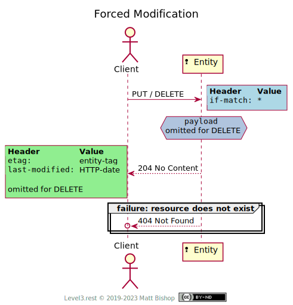

# Entity (Mixin)

##### `Profile: <http://level3.rest/profiles/mixins/entity>`

Resources often have identifiably-distinct instances of themselves defined by unique URIs. These instances are known as [Entities](https://wikipedia.org/wiki/entity) in the real world. An entity must exist in order to be operated with, and operations on them should be performed with an awareness of their current state.

The HTTP specification has some important features to support Entity operations. These features take the form of validation headers, and they are used for both caching and state modification management. Thanks to these headers, clients enjoy the performance benefits of cached response payloads by using these same headers in `GET` requests. Also, Clients can safely operate with an Entity resource by knowing the version they are working with has not changed since they last interacted with it.

The header values `ETag` and `Last-Modified` are often transparently managed by HTTP clients, especially in browsers. A client should learn about conditional request support in their http client library and enable these features.

Almost every Level 3 resource profile can use the Entity mixin to improve the Client's performance and reliable usage. Resource implementers may find that it is more costly to support the Entity profile, but the gains for the client are usually worth the effort because of the Client’s gains.

### Discovery

A `HEAD` request will return the headers described in the table below. An Entity resource may not be able to provide both `ETag` and `Last-Modified`, but at least one must be provided for `HEAD` and `GET` requests.

{: .center-image}

| Header        | Value                                                        |
| ------------- | ------------------------------------------------------------ |
| Profile       | `<http://level3.rest/profiles/mixin/entity>`                 |
| ETag          | An [*entity-tag*](https://tools.ietf.org/html/rfc7232#section-2.3) identifying the entity version |
| Last-Modified | The [*HTTP-date*](https://tools.ietf.org/html/rfc7231#section-7.1.1.1) the entity was last modified |

### Cache-Aware Fetch

When a client makes subsequent fetch requests for a resource that has been previously fetched, they can send validator headers to indicate the version of the representation they already possess. If the resource has not changed, then the resource responds with `304 Not Modified` and the already-fetched response payload can be reused.

{: .center-image}

### Conditional Operation

A client can modify an Entity resource's state using `PUT` and `PATCH`, remove the resource using `DELETE`, or use the resource’s `POST` operation to create new resources. Due to the distributed nature of the internet, clients usually do not want to miss other modifications, either from another client or a backend system, and cause inconsistent state with their own request. This problem, known as the "lost update" problem, is solved by reusing the validator headers from the fetch request. The client will send the `ETag` value in the `If-Match` header and the `Last-Modified` value in the `If-Unmodified-Since` header with their operation.

{: .center-image}

If the client's version of the resource does not match the resource's version, or it has been modified after the client's version, the resource will respond with `412 Precondition Failed`. The client must fetch the resource again and attempt the operation with new values for `If-Match` and `If-Unmodified-Since`.

If the client does not send `If-Match` or `If-Unmodified-Since` headers, and the resource requires them for the operations, it will send back `428 Precondition Required` to indicate this requirement. The client should `GET` the resource, evaluate it's state and then send a conditional operation request with the new data. For `DELETE` operations the client may use `HEAD` instead to collect the most-current validation values as a payload is not sent.

Once the client's operation is successful, the resource sends back the new `ETag` and `Last-Modified` values in the response for `PUT` and `PATCH` operations. `POST` operations also return these headers, but they refer to the newly-created resource if it is an Entity resource. `DELETE` operations do not return validation headers.

Entity resources do not send back the representation payload on success, but rather `204 No Content`. It is reasonable to assume the client which just sent the modification request already has this payload locally and need not receive it again.

### Forced Modification

A client may decide that they are not concerned with working from the most-current version of the resource, as their change must override other client's changes. To force a modification or deletion of an Entity resource, the client will send an `If-Match: *` header with their `PUT` or `DELETE` operation. Any the existing resource state will be overwritten or deleted. However, if the Entity does not exist, the operation fails. One cannot create a nonexistent resource with `PUT`.

`PATCH` is not supported as `PATCH` requires contextual markers in the payload to facilitate the modification. Similarly, `POST` is also not supported because the payload of the `POST` will have been fetched from the resource as content. A change in that content is relevant and must be re-fetched before being used in the `POST`. 

{: .center-image}

## Preflight Mixin

An Entity resource can mix in the [Preflight](preflight.md) profile to give the client the option of preflighting `PUT`, `POST` and `PATCH` operations with large payloads. The client can the [Preflight Modification](preflight.md#preflight-modification) flow by adding the headers in the table below. Other profile of the resource may require additional preflight headers as well.

| Header              | Value         | Rejection Status Codes         |
| ------------------- | ------------- | ------------------------------ |
| If-Match            | entity-tag, * | 404, 410, 412 (for entity-tag) |
| If-Unmodified-Since | HTTP-date     | 404, 410, 412                  |

Once the resource responds with `100 Continue` then the client can send a full request including a payload. 

## Specifications

Additional HTTP Status Codes: [RFC 6585](https://tools.ietf.org/html/rfc6585)

- 428 Precondition Required: [section 3](https://tools.ietf.org/html/rfc6585#section-3)

HTTP/1.1 Semantics and Content: [RFC 7231](https://tools.ietf.org/html/rfc7231)

- 204 No Content: [section 6.3.5](https://tools.ietf.org/html/rfc7231#section-6.3.5)
- 404 Not Found: [section 6.5.4](https://tools.ietf.org/html/rfc7231#section-6.5.4)
- 410 Gone: [section 6.5.9](https://tools.ietf.org/html/rfc7231#section-6.5.9)
- Validation header fields: [section 7.2](https://tools.ietf.org/html/rfc7231#section-7.2)

Conditional Requests: [RFC 7232](https://tools.ietf.org/html/rfc7232)

- Last-Modified: [section 2.2](https://tools.ietf.org/html/rfc7232#section-2.2)
- ETag: [section 2.3](https://tools.ietf.org/html/rfc7232#section-2.3)
- If-Match: [section 3.1](https://tools.ietf.org/html/rfc7232#section-3.1)
- If-None-Match: [section 3.2](https://tools.ietf.org/html/rfc7232#section-3.2)
- If-Modified-Since: [section 3.3](https://tools.ietf.org/html/rfc7232#section-3.3)
- If-Unmodified-Since: [section 3.4](https://tools.ietf.org/html/rfc7232#section-3.4)
- 304 Not Modified: [section 4.1](https://tools.ietf.org/html/rfc7232#section-4.1)
- 412 Precondition Failed: [section 4.2](https://tools.ietf.org/html/rfc7232#section-4.2)

Caching: [RFC 7234](https://tools.ietf.org/html/rfc7234)

