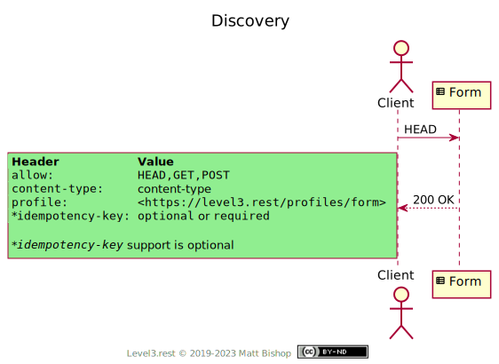

# Form Profile

```
Profile: <https://level3.rest/profiles/form>
```

A Form is a hypermedia control that provides a form for the client to fill in and then accepts that form back in a `POST` request. Anyone who has ever filled out and submitted a paper form in the real world already knows how the Form profile works. The basic concept with Form is to `GET` the representation, fill it in, and `POST` it back.

HTML has had `<form>` controls since the beginning, and they have proven useful for capturing information and state from users in many applications. Over time, HTML forms have added valuable capabilities for client-side field validation and semantic field presentations like `password` and `email`. In a similar spirit, Level 3 forms can supply client-oriented schemas to assist the client in creating user presentations and valid form payloads.

Forms often create new resources, but can also be used to direct a client to a pre-existing resource that matches the submitted form’s content. A Form resource can also represent an API command that changes the system state.

##### Form Content

Forms in Level 3 supply their form representation in two ways. One is to deliver a simple object template with fields that are either empty or pre-populated. The other is to provide a form schema that the client uses to construct a form payload to submit. The client can learn the form representation format during Discovery by reviewing the `Content-Type` header.

### Discovery

The Form profile presents the required `Profile` and `Allow` headers as well as a `Content-Type` header indicating the request payload type. The resource may provide a `Content-Type` like [`application/schema+json`](https://json-schema.org/latest/json-schema-core.html), [`application/prs.hal-forms+json`](https://rwcbook.github.io/hal-forms/) or [`application/xml-dtd`](https://www.w3.org/2006/02/son-of-3023/draft-murata-kohn-lilley-xml-04.html) that can be used to construct a form payload. The client must understand the content type and how to use the schema to produce a submission payload.

Alternately the Form can send a template object with empty fields, which is a good approach for simple forms. In this case the `Content-Type` will reflect the template object’s format, like `application/json` or `application/xml`.

{: .center-image}

### Form Submission

First, a client `GET`s the representation from the Form resource. The representation could be a schema definition or a template object with empty fields. Both the schema and form template can include default values.

If the representation is a schema, then the client uses it to construct a form object. If the representation is a template object then it should be filled in by the client. The completed object is then `POST`ed back to the Form resource.

Clients should always `GET` the representation for every request rather than reusing the schema or form template from a previous request. The Form’s data requirements may have changed since the client last fetched the form representation.

Once the client submits the form, the resource responds with a success message and a `Location` header pointing to a relevant resource. If the submission was unacceptable, then the resource responds with a client error status code and error messages indicating the problem. Common problems include missing required fields or incorrect data in the fields.

##### Rejections

| Status Code                  | Explanation                                                  |
| ---------------------------- | ------------------------------------------------------------ |
| `400 Bad Request`            | The form body is malformed.                                  |
| `403 Forbidden`              | Values in the data are not accepted by business validation rules. |
| `415 Unsupported Media Type` | The media type in the request is not supported.              |
| `422 Unprocessable Entity`   | The form body is semantically-incorrect.                     |

{: .center-image}

##### Idempotent Submissions

A Form resource may offer Clients the option to submit an `Idempotency-Key` header to uniquely identify a submission request. The client can resubmit the request with the same header value to verify that their submission was accepted. Subsequent form submissions with the same `Idempotency-Key` and form body can be considered as ignored by the form resource.

If the resource offers this capability, the GET / HEAD response will contain an `Idempotency-Key` with either `optional` or `required`. `optional` means the client can supply a key if they choose, while `required` means they must submit an `Idempotency-Key` header.

When the client submits a duplicate request using the same `Idempotency-Key`, the resource will return the same response as the original request. If the request has different data than a previous request using the same `Idempotency-KEY`, the resource may choose to respond with a `422 Unprocessable Entity` to indicate the forms are not identical.

The key format is described in the [IETF Draft](https://datatracker.ietf.org/doc/html/draft-ietf-httpapi-idempotency-key-header-00) document for Idempotency-Key. Like ETags, wrap the value in double quotes; for example: `Idempotency-Key: "a7a6dbe0"`.

##### Idempotency-Key Rejections

| Status Code                | Explanation                                                  |
| -------------------------- | ------------------------------------------------------------ |
| `400 Bad Request`          | `Idempotency-Key` header required, but the client did not send one. |
| `409 Conflict`             | The resource is still processing a previous submission with the same key. The client should try again later. |
| `422 Unprocessable Entity` | The form body does not match the original submission body sent with this `Idempotency-Key`. |

# Mixins

## Representation Mixin

A Form resource can provide the [Representation profile](representation.md) as a mixin so the client can receive the relevant `Location`’s representation in the submission response.

## Specifications

HTTP Extensions for WebDAV: [RFC 4918](https://tools.ietf.org/html/rfc4918)

- 422 Unprocessable Entity: [section 11.2](https://tools.ietf.org/html/rfc4918#section-11.2)

HTML 5.2: [Forms](https://www.w3.org/TR/html52/sec-forms.html)

HTTP/1.1 Semantics and Content: [RFC 7231](https://tools.ietf.org/html/rfc7231)

- Content-Type: [section 3.1.1.5](https://tools.ietf.org/html/rfc7231#section-3.1.1.5)
- 200 OK: [section 6.3.1](https://tools.ietf.org/html/rfc7231#section-6.3.1)
- 201 Created: [section 6.3.2](https://tools.ietf.org/html/rfc7231#section-6.3.2)
- 204 No Content: [section 6.3.5](https://tools.ietf.org/html/rfc7231#section-6.3.5)
- 400 Bad Request: [section 6.5.1](https://tools.ietf.org/html/rfc7231#section-6.5.1)
- 403 Forbidden: [section 6.5.3](https://tools.ietf.org/html/rfc7231#section-6.5.3)
- 415 Unsupported Media Type: [section 6.5.13](https://tools.ietf.org/html/rfc7231#section-6.5.13)
- Location: [section 7.1.2](https://tools.ietf.org/html/rfc7231#section-7.1.2)

The Idempotency-Key HTTP Header Field: [section 2](https://datatracker.ietf.org/doc/html/draft-ietf-httpapi-idempotency-key-header-00#section-2)


