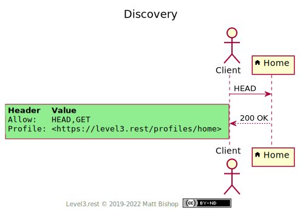
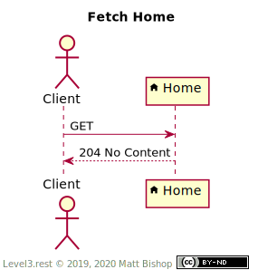

# Home Profile

##### `Profile: <http://level3.rest/profiles/home>`

The Home resource is the top resource for a graph of related resources. Homes cannot be deleted or edited in any way. A Home resource typically has no ID data in it’s URI, which is a stable location for clients to access directly.

### Discovery

The Home profile presents the required `Profile` and `Allow` headers.

{: .center-image}

### Fetch Home

A client can fetch the Home with a `GET` request. The `Link` header will contain links to other resources.

{: .center-image}

## Specifications

HTTP/1.1 Semantics and Content: [RFC 7231](https://tools.ietf.org/html/rfc7231)

- 204 No Content:  [section 6.3.5](https://tools.ietf.org/html/rfc7231#section-6.3.5)


