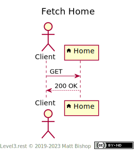

# Home Profile

```
profile: <https://level3.rest/profiles/home>
```

The Home resource is the top resource for a graph of related resources. Homes cannot be deleted or edited in any way. A Home resource typically has no ID data in its URI, which is a stable location for clients to access directly.

### Discovery

The Home profile presents the required `profile` and `allow` headers.

{: .center-image}

### Fetch Home

A client can fetch the Home with a `GET` request. The `link` header will contain links to other resources.

{: .center-image}

## Specifications

HTTP/1.1 Semantics and Content: [RFC 7231](https://tools.ietf.org/html/rfc7231)

- 200 OK: [section 6.3.1](https://tools.ietf.org/html/rfc7231#section-6.3.1)


