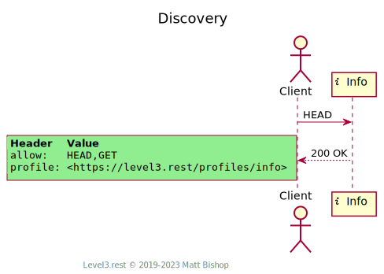

# Info Profile

##### `Profile: <http://level3.rest/profiles/info>`

An Info resource profile provides read-only information. A client does not edit the data in an Info resource, nor does a client `DELETE` an Info resource. Info resources can be used to present calculated state about another resource, like tour dates for a concert, or details of past events like an auction item's minimum bid or a city's historical temperature. If the related resource changes, the Info resource likely changes as well. Similarly, if the client deletes the related resource, the Info resource is also deleted. 

Info resources often take the place of nested data objects in non-hypermedia APIs. In Level 3 APIs they exist as separate resources for more natural delivery and management. The Info’s data may come from a separate service or data store, and thus can be expensive to produce. The client can decide to fetch this related information if they want, or choose not to if it is unnecessary. Alternatively, they may want to re-fetch the Info resource more often than the related resource if the Info resource’s data changes frequently. For instance, a stock’s current market price changes rapidly, but the stock itself does not change. The client can re-fetch the market price Info resource without re-fetching the stock resource.

### Discovery

The Info profile presents the required `Profile` and `Allow` headers.

{: .center-image}

### Fetch Info

A client can fetch the Info’s data with a `GET` request. Clients find related resource links in the `Link` header.

{: .center-image}

# Mixins

## Entity Mixin

Info resources, especially those that present dynamic information, benefit from the Entity profile’s validation headers. These headers enable Entity's [Cache-Aware Fetch](entity.md#cache-aware-fetch) flow.

## Specifications

HTTP/1.1 Semantics and Content: [RFC 7231](https://tools.ietf.org/html/rfc7231)

- 200 OK: [section 6.3.1](https://tools.ietf.org/html/rfc7231#section-6.3.1)

