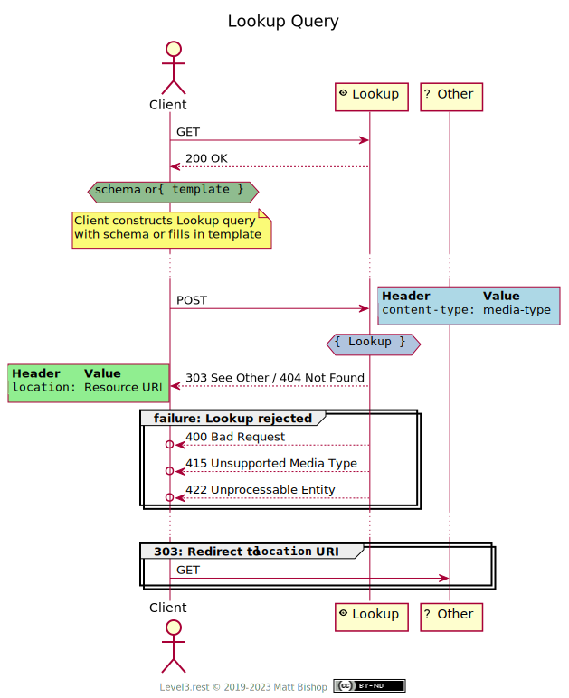

# Lookup Profile

```
profile: <https://level3.rest/profiles/lookup>
```

Lookup resources give clients a way to look up a resource with search parameters. This profile is similar to [Form](form.md) but will not create a new resource. Lookup provides a query object for the client to fill in and then accepts that query back in a `POST` request. The lookup responds with the location of the found resource or a not found status. 

A Lookup query returns a single resource result. The result can be a unique resource that matches the query, such as a product for a product code lookup or a user profile for an account id lookup. If the lookup resource operates as a search resource, like a facet or keyword search, then the result resource could be a [List pattern](../patterns/list.md) resource of matching results.

##### Lookup Query

Lookups in Level 3 supply their lookup representation in two ways. One is to deliver a simple object template with fields that are either empty or pre-populated. The other is to provide a schema that the client uses to construct a payload to submit as a lookup query. The client can learn the lookup representation format by reviewing the `content-type` header.

### Discovery

The Lookup profile presents the required `profile` and `allow` headers as well as a `content-type` header indicating the request payload type. The resource may provide a `content-type` like [`application/schema+json`](https://json-schema.org/latest/json-schema-core.html), [`application/prs.hal-forms+json`](https://rwcbook.github.io/hal-forms/) or [`application/xml-dtd`](https://www.w3.org/2006/02/son-of-3023/draft-murata-kohn-lilley-xml-04.html) that can be used to construct a lookup query payload. The client must understand the content type and how to use the schema to produce a query payload.

Alternately the Lookup can send a template object with empty fields, which is a sufficient approach for most lookups. In this case the `Content-Type` will reflect the format of the template object, like `application/json` or `application/xml`.

{: .center-image}

### Lookup Query Execution

Lookup resources follow the long-standing [POST/Redirect/GET](https://en.wikipedia.org/wiki/Post/Redirect/Get) design pattern to simplify the client’s lookup requests. Successful Lookup requests automatically redirect the client to the result URL, saving them the effort of inspecting the response and making a second call in their code. 

First, a client `GET`s the query representation from the Lookup resource. The representation could be a schema definition or a template object with empty fields. Both the schema and lookup template can include default values.

If the representation is a schema, then the client uses it to construct a lookup query object. If the representation is a template object, then it should be filled in by the client. The completed object is then POSTed back to the Lookup resource.

Clients should always `GET` the representation for every request rather than reusing the schema or query template from a previous request. The Lookup's query format may have changed since the client last fetched the representation.

Once the client submits the query, the resource responds with a `303 See Other` status and a `location` header pointing to the found resource. The client will then `GET` this resource if configured to follow redirects automatically and return the response to the application. If the submission was unacceptable, then the resource responds with a client error status code and error messages indicating the problem. Common problems include missing required fields or incorrect data in the fields.

##### Rejections

| Status Code                  | Explanation                                     |
|------------------------------|-------------------------------------------------|
| `404 Not Found`              | The query has no matching result.               |
| `400 Bad Request`            | The query’s body is malformed.                  |
| `415 Unsupported Media Type` | The media type in the request is not supported. |
| `422 Unprocessable Entity`   | The query is semantically incorrect.            |

{: .center-image}

# Mixins

## Representation Mixin

A Lookup resource can provide the [Representation profile](representation.md) as a mixin so clients can receive the relevant `location`’s representation in the submission response. This approach saves the round-trip to GET the found resource at the cost of missing a possibly-cached representation in the GET request.

## Specifications

HTTP Extensions for WebDAV: [RFC 4918](https://tools.ietf.org/html/rfc4918)

- 422 Unprocessable Entity: [section 11.2](https://tools.ietf.org/html/rfc4918#section-11.2)

HTML 5.2: [Forms](https://www.w3.org/TR/html52/sec-forms.html)

HTTP/1.1 Semantics and Content: [RFC 7231](https://tools.ietf.org/html/rfc7231)

- `content-type`: [section 3.1.1.5](https://tools.ietf.org/html/rfc7231#section-3.1.1.5)
- 200 OK: [section 6.3.1](https://tools.ietf.org/html/rfc7231#section-6.3.1)
- 303 See Other: [section 6.4.4](https://tools.ietf.org/html/rfc7231#section-6.4.4)
- 400 Bad Request: [section 6.5.1](https://tools.ietf.org/html/rfc7231#section-6.5.1)
- 404 Not Found: [section 6.5.4](https://tools.ietf.org/html/rfc7231#section-6.5.4)
- 415 Unsupported Media Type: [section 6.5.13](https://tools.ietf.org/html/rfc7231#section-6.5.13)
- `location`: [section 7.1.2](https://tools.ietf.org/html/rfc7231#section-7.1.2)


