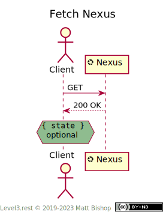

# Nexus Profile

```
Profile: <https://level3.rest/profiles/nexus>
```

A Nexus resource is a central “meeting point” for related resources. It is often identified by a shared business identifier, like invoice number or a book’s ISBN. A Nexus resource may have state information, but it is read-only and should reflect an overall business state. For instance, an order resource can have the states `open` or `closed`.

Clients discover related states via the links attached to the Nexus. The order resource’s shipping details, payment info and other order-related states are related to the Nexus resource but are linked, not embedded, in the Nexus resource. These resources offer affordances to manipulate the state of the order.

A Nexus resource offers the `DELETE` operation which removes the Nexus resource instance from the system. Related resources remove their states as a result of a successful delete.

### Discovery

The Nexus profile presents the required `Profile` and `Allow` headers. If the resources offers no state data, it will return `204 No Content`.

{: .center-image}

### Fetch Nexus

A client can fetch the Nexus’ state with a `GET` request. The state information is in the payload. If the resource has no state, it will return `204 No Content` instead of `200 OK` and a state body.

{: .center-image}

### Remove Nexus

Nexus resources, as central points of business context, might be removable from the underlying system. Removing a Nexus may have follow-on effects on related resources such that they are also removed or orphaned by the removal of their linked Nexus resource.

Clients remove a nexus by sending a `DELETE` request.

{: .center-image}

## Specifications

HTTP/1.1 Semantics and Content: [RFC 7231](https://tools.ietf.org/html/rfc7231)

- 200 OK: [section 6.3.1](https://tools.ietf.org/html/rfc7231#section-6.3.1)
- 204 No Content: [section 6.3.5](https://tools.ietf.org/html/rfc7231#section-6.3.5)
- 404 Not Found: [section 6.5.4](https://tools.ietf.org/html/rfc7231#section-6.5.4)


