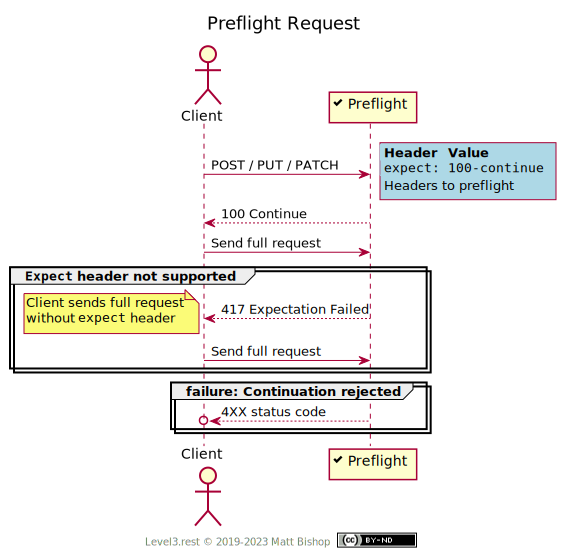

# Preflight (Mixin)

##### `Profile: <http://level3.rest/profiles/mixins/preflight>`

A resource that accepts POST, PUT or PATCH requests can offer to preflight a request's headers before the full request payload is sent. This is valuable to calls where the payload is large or expensive to produce. If the resource rejects the client's preflight request, the full payload delivery can be skipped.

### Discovery

Resources that support the Preflight profile will include in the Preflight profile header it it's list of profile headers.

{: .center-image}

### Preflight Modification

A client uses preflight modification to check if a resource will accept the content of a `PUT`, `POST` or `PATCH` request before actually sending the entire content. Also known as "look before you leap", this approach takes two requests to complete but saves time overall if the full modification request will be rejected. The client can skip sending the content if the preflight request fails. The Client initiates the preflight request sequence by sending the requested operation with a `Expect: 100-continue` header, the headers to be preflighted, and an empty body. The resource may require certain headers to be preflighted and reject the preflight request with an appropriate status code.

{: .center-image}

The preflight response of `100 Continue` is not a guarantee of acceptance but rather a likelihood of acceptance. The resource may still choose to reject the full request upon delivery for other reasons.

### Decision Flow

If the resource accepts the preflight request, it will return the status `100 Continue` and the client can send the full request with payload. If the resource cannot perform preflight for any reason, but will still try to accept the request, it sends back `417 Expectation Failed`. The client falls back to the non-preflight version of the flow and sends the full request with payload.

If the resource rejects the continuation request it will respond with a status code indicating why the request is rejected.

{: .center-image}

## Specifications

HTTP/1.1 Semantics and Content: [RFC 7231](https://tools.ietf.org/html/rfc7231)

- Expect: [section 5.1.1](https://tools.ietf.org/html/rfc7231#section-5.1.1)
- 100 Continue: [section 6.2.1](https://tools.ietf.org/html/rfc7231#section-6.2.1)
- 417 Expectation Failed: [section 6.5.14](https://tools.ietf.org/html/rfc7231#section-6.5.14)

