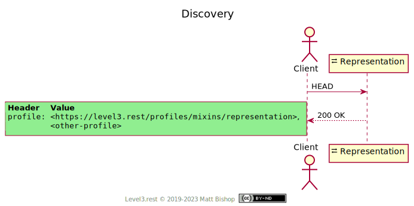
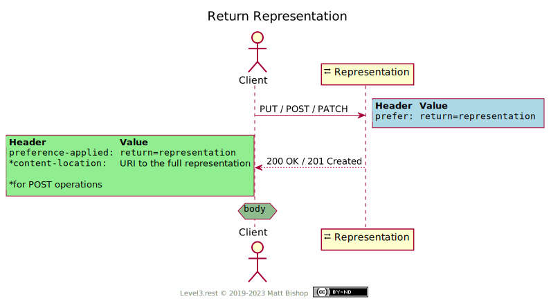
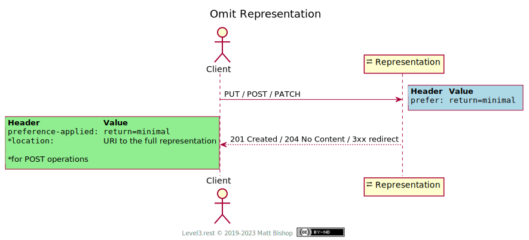

# Representation Profile (Mixin)

```
Profile: <https://level3.rest/profiles/mixins/representation>
```

Resources that accept `POST`, `PUT` or `PATCH` requests may or may not return a representation in the response. The client might want the response returned, however, to save a subsequent `GET` request, or to omit a returned representation to save transmission time. The Representation profile gives a client the ability to specify that they prefer the created or modified representation returned with the response or omitted from the response.

### Discovery

Resources that support the Representation profile include the Representation profile header in its list of profile headers.

{: .center-image}

### Return Representation

The client sends a `Prefer: return=representation` header indicating that they want the content of the representation returned with the response. This header saves them from having to issue a `GET` request to fetch the state. The resource returns a status of `200 OK` instead of `204 No Content` for `PUT` and `PATCH` operations. In the case of a `POST` response, the `Location` header will be omitted. Instead, the response will have a `Content-Location` header that indicates the URL for the full representation. 

Some profiles (see [Action](./action.md) and [Lookup](./lookup.md)) use the `POST` operation and return a redirect status code such as `303` or `307` along with a `Location` header that the client follows to retrieve the resource. When a resource implements the Representation mixin, and the client sends `Prefer: return=representation` in their request, the resource will return the resource representation instead of a redirect status.

{: .center-image}

### Omit Representation

The `Prefer` header parameter `return` also accepts the value `minimal`  which tells the resource to return no representation and instead return the normal status code for that resource operation. `POST` operations will add the appropriate `Location` header. 

{: .center-image}


## Specifications

HTTP/1.1 Semantics and Content: [RFC 7231](https://tools.ietf.org/html/rfc7231)

- 200 OK: [section 6.3.1](https://tools.ietf.org/html/rfc7231#section-6.3.1)
- 201 Created: [section 6.3.2](https://tools.ietf.org/html/rfc7231#section-6.3.2)
- 204 No Content: [section 6.3.5](https://tools.ietf.org/html/rfc7231#section-6.3.5)

Prefer Header for HTTP: [RFC 7240](https://tools.ietf.org/html/rfc7240)

- return=representation / return=minimal: [section 4.2](https://tools.ietf.org/html/rfc7240#section-4.2)


