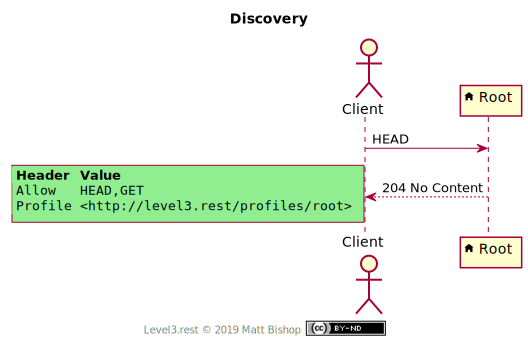
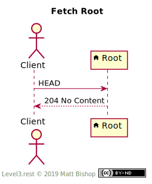

# Root

##### `Profile: <http://level3.rest/profiles/root>`

The Root resource is the top resource for a graph of related resources. Roots cannot be deleted or edited in any way.

### Discovery

The Root profile presents the required `Profile` and `Allow` headers.

{: .center-image}

### Fetch Root

A Client can fetch the Root with a `GET` request. The `Link` header will contain links to other resources.

{: .center-image}

## Specifications

HTTP/1.1 Semantics and Content: [RFC 7231](https://tools.ietf.org/html/rfc7231)

- 204 No Content:  [section 6.3.5](https://tools.ietf.org/html/rfc7231#section-6.3.5)

