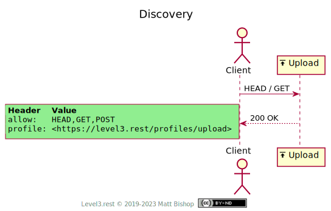
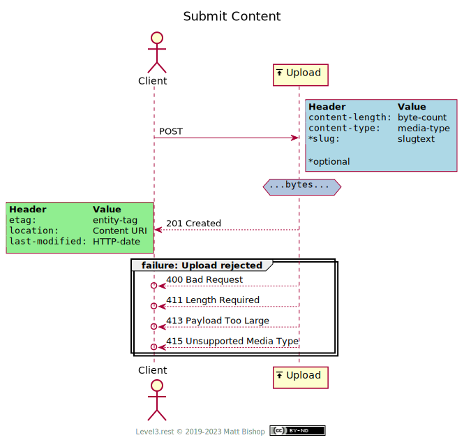

# Upload Profile

```
Profile: <http://level3.rest/profiles/upload>
```

The Upload profile accepts byte-based payload submissions. The Upload resource can be thought to create a [Content](content.md) resource representing the submitted content.

### Discovery

The Upload profile presents the required `Profile` and `Allow` headers.

{: .center-image}

### Submit Content

Submit a content request to the resource. Clients are encouraged to send the `Content-Length` and `Content-Type` headers if known. The resource may require `Content-Length` and send back `411 Length Required` to the client if a request omits it. The resource may respond with rejection status codes for size and media type failures.

Clients can optionally send a `Slug` header that can be used to identify the submitted content later. The slug can be a file name, a title, or anything that helps identify the content. The slug’s text may show up in the Content’s URL, and possibly the `Content-Disposition` header. For more details on the [Slug header](https://bitworking.org/projects/atom/rfc5023.html#rfc.section.9.7), please refer to the Atom publishing protocol.

The  `POST` response headers include the newly-created [Content](content.md) resource’s URL in `Location` as well as it's Entity validation headers (`ETag`, `Last-Modified`) if available.

{: .center-image}

#### No Multipart Content

1. HTTP 1.1 provides a way to mix multiple content parts in a single request with the [Multipart content type](https://www.w3.org/Protocols/rfc1341/7_2_Multipart.html). Upload chooses not to support Multipart uploads, however, for two reasons:

   1. Impossible to discover part submission requirements. Level 3's primary architecture quality is [Discoverability](../qualities.md#discoverability). To learn how to use a resource, one must be able to discover it's affordances without external documentation or other out-of-band communication. Multipart does not provide this type of discovery mechanism, and the client must rely on other sources to learn what part types are acceptable and what is an acceptable submission format.
   2. HTTP/2 makes Multipart less relevant. Multipart solves a batching problem where a client wants to send multiple submissions in a single batched request. [HTTP/2](https://hpbn.co/http2/#request-and-response-multiplexing) makes it easier to send multiple submissions without requiring the complexity of Multipart requests. HTTP/2 uses request multiplexing and HTTP pipelining to manage simultaneous uploads over a single connection.

# Mixins

## Preflight Mixin

The [Preflight profile](preflight.md) mixin allows a client to validate content submission before sending a payload. The client must send `Content-Length` and `Content-Type` as preflight headers.

## Specifications

HTTP/1.1 Message Syntax and Routing: [RFC 7230](https://tools.ietf.org/html/rfc7230)

- Content-Length: [section 3.3.2](https://tools.ietf.org/html/rfc7230#section-3.3.2)

HTTP/1.1 Semantics and Content: [RFC 7231](https://tools.ietf.org/html/rfc7231)

- Content-Type: [section 3.1.1.5](https://tools.ietf.org/html/rfc7231#section-3.1.1.5)
- 201 Created: [section 6.3.2](https://tools.ietf.org/html/rfc7231#section-6.3.2)
- 204 No Content: [section 6.3.5](https://tools.ietf.org/html/rfc7231#section-6.3.5)
- 411 Length Required: [section 6.5.10](https://tools.ietf.org/html/rfc7231#section-6.5.10)
- 413 Payload Too Large: [section 6.5.11](https://tools.ietf.org/html/rfc7231#section-6.5.11)
- 415 Unsupported Media Type: [section 6.5.13](https://tools.ietf.org/html/rfc7231#section-6.5.13)
- HTTP-date: [section 7.1.1.1](https://tools.ietf.org/html/rfc7231#section-7.1.1.1)
- Location: [section 7.1.2](https://tools.ietf.org/html/rfc7231#section-7.1.2)

Conditional Requests: [RFC 7232](https://tools.ietf.org/html/rfc7232)

- Last-Modified: [section 2.2](https://tools.ietf.org/html/rfc7232#section-2.2)
- ETag: [section 2.3](https://tools.ietf.org/html/rfc7232#section-2.3)

The Atom Publishing Protocol: [RFC 5023](https://bitworking.org/projects/atom/rfc5023.html)

- Slug: [section 9.7](https://bitworking.org/projects/atom/rfc5023.html#rfc.section.9.7)


